# high-level architecture of a production app

## 0. CI/CD pipeline
* allows our code to travel from our repo, through a series of tests and checks, to our prod server w/o manual intervention
* configures using the following technologies among others
    * jenkins
    * GH actions
## 1. load balancers
* allow our prod servers to handle varying amounts of traffic
* most common load balancer is nginx

## 2. storage
* a repository of data that our prod servers can access
* said storage does not run on the same environment as the servers

## 3. logging and monitoring
* allow us to see what happens to our prod servers during interactions with users
* best practice is to store logs in an external server
* examples of loggers and monitors
    * PM2 for back-end
    * sentry for FE
    * ELK stack
* monitors alert the, well, alert service when an anomaly or atypical action/state is discovered
    * alert service will, well, alert the relevant group of people
    * best practice is to integrate said alerts into common collaboration platforms, for example, slack
* say we have a bug
    * devs are alerted through slack
    * devs check the logs for patterns etc to identify the problem
    * devs replicate the problem in a sandbox/staging/test environment
        > **muhimu tena sana!**  - do not debug in prod env   - repeat: do not debug in prod    
    * devs roll out a hot-fix once the bug is solved
    * monitor hot-fix

## 4. illustrations
### 4.1. overall

### 4.2. CI/CD

### 4.3. logging and monitoring

### 4.4. debugging and applying hot-fixes

```mermaid
    sequenceDiagram
        participant U as Users
        participant P as Prod Servers
        participant S as Slack/Alerts
        participant D as Developers
        participant T as Test/Staging
        participant C as CI/CD
        
        U->>P: Encounter Bug
        P->>P: Crash/Error
        P->>S: Alert Triggered
        S->>D: 🚨 Bug Alert in Slack
        Note over D: NEVER DEBUG IN PROD!
        
        D->>S: Ack & Triage
        D->>P: Check Logs (Read-only)
        D->>T: Replicate in Staging
        T->>T: Confirm Bug Behaviour
        
        D->>D: Identify Root Cause
        D->>D: Write Hotfix
        D->>C: PR with Hotfix
        C->>T: Deploy to Staging
        T->>D: Tests Pass ✅
        
        D->>C: Approve Production Deploy
        C->>P: Rollout Hotfix
        P->>S: Monitor Post-Deploy
        S->>D: All Clear ✅
```

