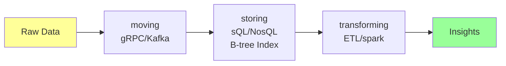
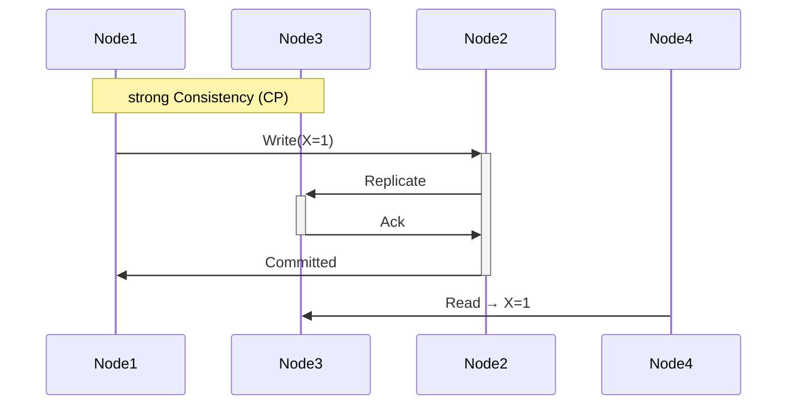
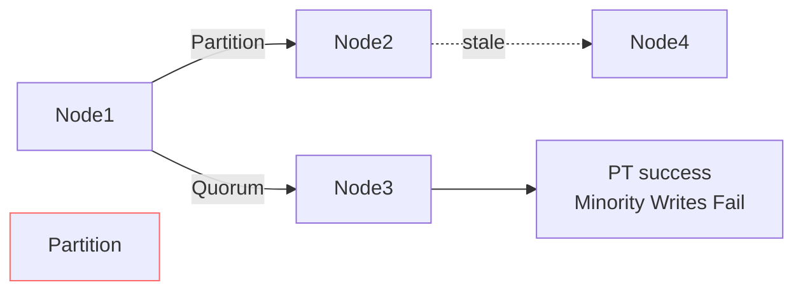

# Design Requirements

<div style="text-align: justify;">

## 0. WTF is a *"good design"*?

* good design transcends aesthetics; in systems engineering, it embodies quantifiable attributes enabling long-term viability amid evolving demands
* we dissect it via four features—scalability, maintainability, efficiency, reliability—and three elements: data movement, storage, transformation

### 0.1. features 
* these pillars ensure systems endure growth, scrutiny and failure

- **scalability** → ability of system to grow (aka scale) as fast as the user base
  - **horizontal** (scale-out): add nodes (e.g. kubernetes pods)
  - **vertical** (scale-up): Boost resources per node
  - metrics: handles 10x traffic without >20% latency spike
- **maintainability** → how clear our system is to future devs for maintenance and improvement purposes
  - Principles: modularity, documentation, observability (logs/metrics/traces)
  - metrics: Cyclomatic complexity <10; MTTR (mean time to repair) <1h
- **efficiency** → how well the system uses available resources
  - CPU/memory I/O optimisation; e.g. Big O analysis $O(n \ log \ n)$ sorts
  - metrics: Resource utilisation >80%; cost per transaction <£0.01
- **reliability** → how resilient a system is to atypical behaviour of any combination of its components
  - handles faults via redundancy; e.g. 99.99% uptime
  - metrics: MTBF >10,000h; failure rate <0.01%

```mermaid
graph TB
    GD[good design] --> s[scalability<br/>horizontal/vertical]
    GD --> M[maintainability<br/>modularity/MTTR]
    GD --> E[efficiency<br/>Big O/utilisation]
    GD --> R[reliability<br/>MTBF/uptime]
    S --> SH[scale-Out: K8s]
    S --> SV[scale-up: CPU/RAM]
    M --> O[observability: Logs/Traces]
    E --> BO[O(n log n)]
    R --> Red[redundancy]
    style GD fill:#f9f,stroke:#333,stroke-width:4px
```

### 0.2. elements 
* data lifecycle drives design choices

- **moving data** → the ease with which data gets from one part of the system to another
  - Protocols: gRPC (binary, low-latency), Kafka (pub-sub)
  - Challenges: serialisation (Protobuf), bandwidth bottlenecks
- **storing data** → the access patterns, indexing strategies and back-up solutions that influence our choice of DB
  - sQL (ACID: PostgresQL), NosQL (CAP-tuned: MongoDB)
  - Indexing: B-trees (\( O(\log n) \)); backups: WAL + snapshots
- **transforming data** → the ease with which raw data is turned into meaningful information
  - ETL pipelines (spark), ML inference (TensorFlow serving)
  - metrics: transformation throughput >1k rows/s



## 1. CAP theorem

* aka brewer's theorem 
* brewer's 2000 conjecture, proved by gilbert/lynch (2002), bounds distributed systems: in asynchronous networks with partitions, choose *at most two* of Consistency (C), Availability (A), Partition tolerance (P)
> **formal:** for any execution, cannot guarantee both linearisability (C) and availability (A) during partitions

```mermaid
    quadrants
        title CAP Triangle
        C[Consistency<br/>All see same data] -->|No P| CA
        A[Availability<br/>All requests served] -->|No P| CA
        C -->|No A| CP
        P[Partition Tolerance<br/>Works despite splits] -->|No A| CP
        A -->|No C| AP
        P -->|No C| AP
        style P fill:#ff9999
```

- **consistency** → whether or not all nodes in said distributed sys have the same data at the same time
  - **linearisability**: Appears as single atomic copy
  - **implementation**: 2PC (two-phase commit), Paxos/Raft consensus
- **availability** → whether or not the sys is accessible by users at all times regardless of anomalies in the background
  - every non-failed request gets a response
- **partition tolerance** → whether or not the sys works when a network partition acts atypically or ceases to function
  - system should work even if one or more nodes fails to communicate with the rest
  - assumes byzantine faults possible

* CAP theorem states that a distributed system may only achieve any two of the aforementioned principles; never all three

- **CA** → achieving consistency and availability means foregoing partition tolerance
  - single-node/traditional RDBMs (e.g. MysQL standalone)
- **CP** → achieving consistency and partition tolerance means foregoing availability
  - e.g. a banking system are designed to let transactions take longer than usual to complete if necessary in order to guarantee consistency and partition tolerance (e.g. MongoDB with strong writes)
- **AP** → achieving availability and partition tolerance means foregoing consistency
  - e.g. Cassandra (tunable consistency), Amazon Dynamo

> **Lesson** <br/> - every design decision comes with trade-offs; a sys optimised for read ops may perform poorly at write ops <br/> - to achieve a particular level of performance, we must give up certain complexities <br/> - finding the best solution ❌ <br/> - finding the best solution for a specific use case ✅<br/><br/>

### 1.1. availability 
* is our system accessible by users 99.999% of the time? This is *c.* five minutes of down time annually (99.9% is *c.* 8.76 hours p.a. by the way)

<br/><br/> $uptime = \frac{\text{total time} - \text{downtime}}{\text{total time}} \times 100$ <br/><br/>

#### 1.1.1. SLOs and SLAs 
- **SLOs** (service level objectives): internal targets, e.g. 99.9% uptime over 28d
- **SLAs** (service level agreements): contractual, e.g. <0.1% downtime → credits
- relation: SLOs < SLA targets for buffer

#### 1.1.2. metrics 
*Expect the unexpected* &rarr; build in redundancies → RAIDs, graceful degrading etc

**Redundancy/reliability metrics:**
- **reliability** → $R(t) = e^{-\lambda t}$ (exponential failure); $MTBF = \frac{1}{\lambda}$
- **fault tolerance** → N+1 redundancy; checkpointing
- **redundancy** → active-active (multi-master), hot spares

**speed metrics:**
- **throughput** → $\frac{\text{requests}}{\text{second}}$ (RPs); tail at 99th percentile
- **latency** → tail latency amplification; amdahl's law limits

```mermaid
    gantt
        title Availability metrics Timeline
        dateFormat HH:mm
        section uptime Calc
        99.999% :done, ut, 2026-01-21 13:00, 525600m
        Downtime :crit, dt, after ut, 5m
```



### 1.2. consistency 
* all replicas mutually agree on data state
* PACELC refines CAP: During partitions (P), choose consistency (C) or availability (A); else latency (L) or consistency (C)

- **strong**: Linearisability ( $\forall$ reads see latest write)
  - Proto: Paxos ($ O(n) $ messages/round)
- **Eventual**: Monotonic reads; e.g. vector clocks
- **Quorums**: $ W + R > N $ guarantees intersection

**Models comparison:**
| Model | Guarantee | Overhead | Example |
|-------|-----------|----------|---------|
| Linearisability | Total order | High (consensus) | Raft |
| sequential | Per-op order | Medium | spanner |
| Causal | Happens-before | Low | Bayou |
| Eventual | Convergence | Minimal | Riak |

**Math:** Read quorum $ R $, write $ W $: Intersection if $ R + W > N $



### 1.3. partition tolerance 
* networks fail: 12.9% packet loss in wild (CAIDA)
* PT requires progress despite <50% node loss

- **detection:** Phi accrual failure detector ($ \phi $-threshold)
- **handling:** 
  - split-brain resolution via STONITH (Shoot The Other Node In The Head)
  - quorum: $\lfloor \frac{N}{2} \rfloor + 1$
- **advanced:** view stamped replication; chain replication ($O(1)$ reads)

* **real-world:** ScyllaDB tunes PT with rack-aware placement



> **takeaway:** PACELC (P/A then L/C) for nuanced trade-offs; benchmark with Chaos Engineering (e.g. Netflix Chaos Monkey)

13:22

</div>