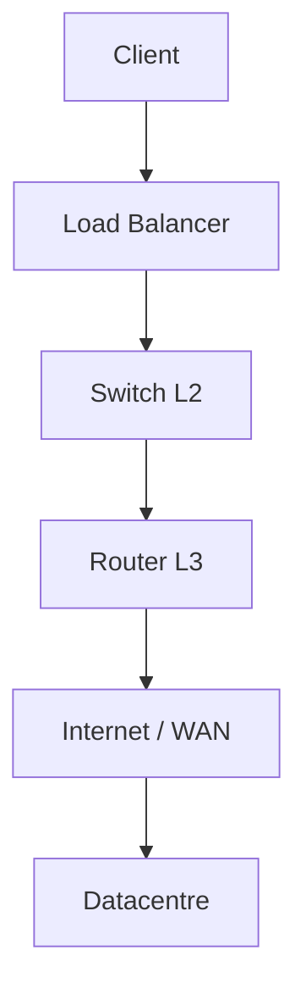
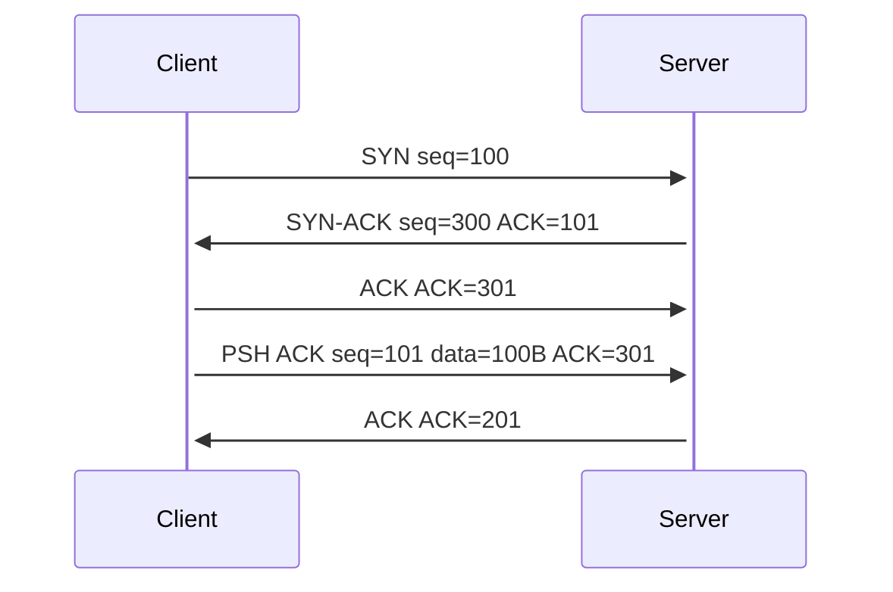
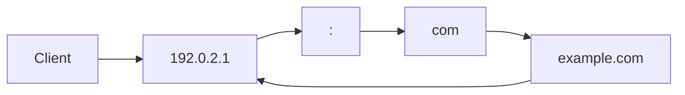
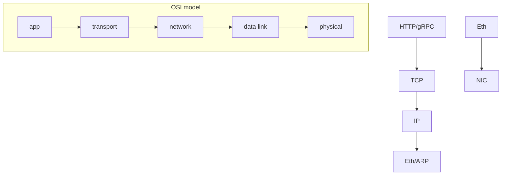

# networking

<div style="text-align: justify;">

## 0. intro

networking underpins system design by enabling scalable, resilient distributed architectures from microservices to global CDNs

### 0.1. WTF is networking?
- interconnects devices for data exchange in system design
- leverages layered models like TCP/IP or OSI for abstraction
- packets traverse networks via routing and switching
- critical for load balancing, failover, and horizontal scaling 

### 0.2. how TF is networking useful?
- powers microservices communication via apis over TCP
- enables high availability with anycast and BGP routing
- supports sharding and replication across data centres
- facilitates zero-downtime deploys via service meshes like istio

### 0.3. components of a network
- hosts (clients, servers) generate traffic
- links (ethernet, fibre) carry bits
- layer 2 switches forward by MAC
- layer 3 routers decide paths by IP
- firewalls enforce policies



## 1. TCP

### 1.1. TF is TCP?
- transport layer (L4) protocol for reliable byte-stream delivery
- connection-oriented with handshake
- guarantees order, no duplicates, no losses
- used in HTTP/2, mySQL, redis

### 1.2. how TF does TCP work?
- three-way handshake: SYN(seq=$x$), SYN-ACK(seq=$y$, ACK=$x+1$), ACK(ACK=$y+1$)
- data transfer: seq += len(data), ACK = nextseq
- flow control: `rwnd` (receive window) advertises buffer space
- congestion control: `cwnd` starts at 1 MSS, slow start doubles per RTT until `ssthresh`, then linear

$$cwnd \leftarrow \min(cwnd, rwnd)$$

- retransmit on 3 duplicate ACKs or rto timeout

### 1.3. TCP in system design
- HTTP servers tune keepalive, nagle off
- databases use persistent connections
- latency: handshake adds 1.5 RTT, head-of-line blocking
- altenatives: quickk multIPlexes over UDP



## 2. UDP

### 2.1. TF is UDP?
- connectionless datagram protocol L4
- minimal 8-byte header: sport, dport, len, checksum
- no reliability, ordering, flow control
- fire-and-forget semantics 

### 2.2. how TF does UDP work?
- app writes to socket, kernel adds header + IP
- checksum: $\sim(\sum \ \text{16bit words}) \mod 2^{16}$
- receiver discards bad checksums
- multicast/broadcast native support

### 2.3. UDP in system design
- DNS queries (53), NTP time sync
- live video (RTP), VoIP (webRTC)
- kafka, flume for logs
- quick builds reliability atop UDP

```mermaid
    sequenceDiagram
        Client->>Server: UDP port 53 DNS query
        alt loss
            Note: discarded
        else ok
            Server->>Client: UDP response
        end
```

## 3. DNS

### 3.1. TF is DNS?
- hierarchical distributed database for name-to-IP
- UDP/TCP port 53, 512b payload limit UDP
- records: a (IPv4), aaaa(IPv6), cname, mx, ns, txt

### 3.2. how TF does DNS work?
- recursive resolver chains: stub -> recursive -> root -> tld -> auth
- iterative from recursive: root name server gives TLD referral
- cache with TTL, negative caching
- anycast routes to nearest anycasted IP

### 3.3. DNS in system design
- service discovery: consul, etcd DNS interfaces
- geo-routing via anycast / eDNS client subnet
- rate limiting prevents ddos
- DNSsec rsasha256 signatures



## 4. IP

### 4.1. TF is IP?
- network layer L3, best-effort packet routing
- IPv4 32bit addresses, IPv6 128bit
- connectionless, no guarantees
- fragmentation, TTL hop limit

### 4.2. how TF does IP work?
- route by longest prefix match in fib
- `ttl--`, drop if 0 (loop prevention)
- `df` bit prevents frag if path mtu discovery
- `ecn` marks congestion

### 4.3. IP addresses and IP headers
- IPv4 header: 20b min (vers=4, ihl=5, tos, id, flags+fragoff, TTL, proto, cksum, SIP, DIP)
- cidr: 10.0.0.0/8 private, /24 subnet 256 hosts
- IPv6: 40b fixed, no cksum/frag host-only, flow label

| field | IPv4 | IPv6 |
|-------|------|------|
| addr bits | 32 | 128 |
| header | variable | 40b |
| NAT | common | rare |
| ext hdr | options | chain   |

## 5. other networking protocols

### 5.1. ARP
- IPv4-to-MAC resolution L2
- broadcast who-has IP? tell MAC
- gratuitous ARP for dup IP detect
- replaced by NDP in IPv6

### 5.2. telnet
- RFC854 port 23 TCP terminal emulation
- NVT (network virtual terminal) 7bit ASCII
- insecure, telnetlib python lib
- superseded by SSH

### 5.3. ICMP, DHCP and BGP
- ICMP: ping (type8/0), path MTU (type3 code4)
- DHCP: dynamic IP lease (discover offer request ACK)
- BGP: inter-as routing, path vector prevents loops

## 6. putting it all together

- request flow: DNS UDP53 → TCP SYN443 → tls → HTTP/2 → IP route → ethernet
- system design: l7 proxy (envoy) → l4 lb → l3 anycast → BGP
- metrics: RTT, loss, throughput = `cwnd`/RTT
- scale: sharding by consistent hash, replication factor 3



</div>
