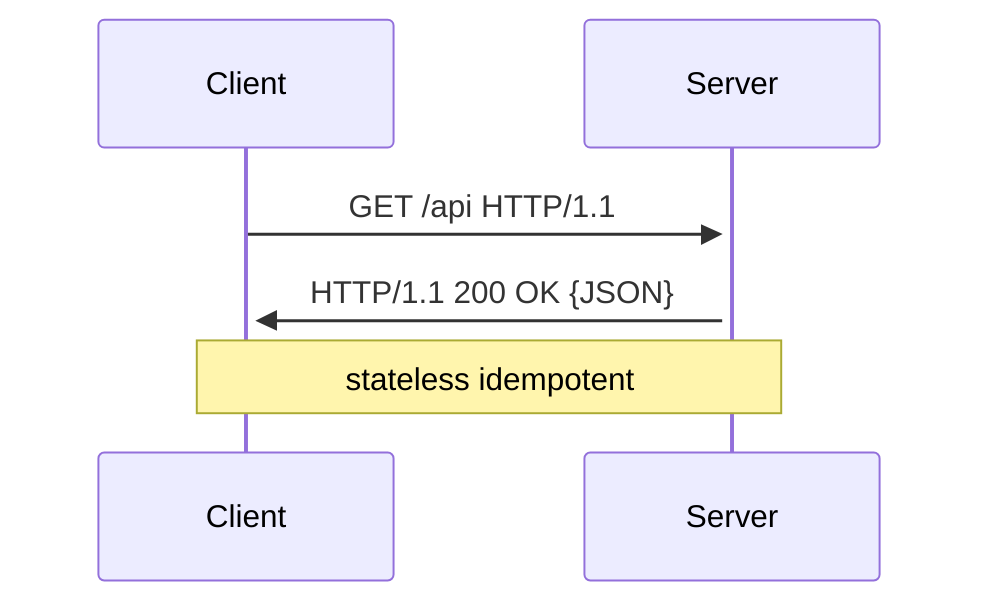
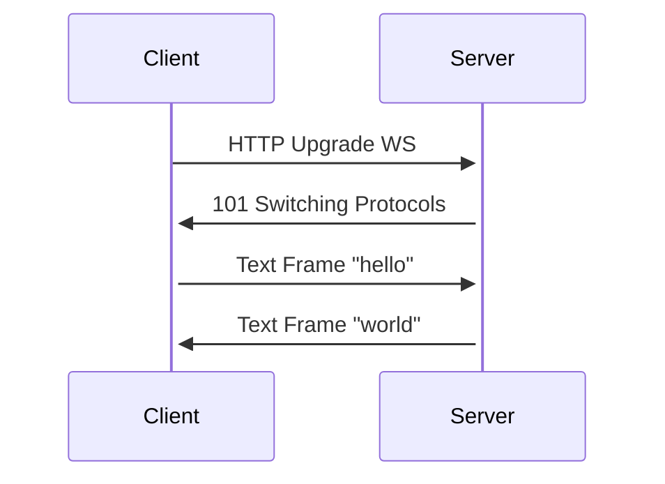
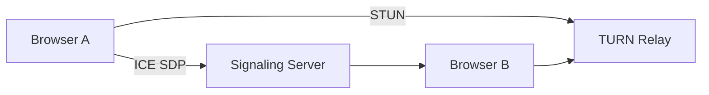
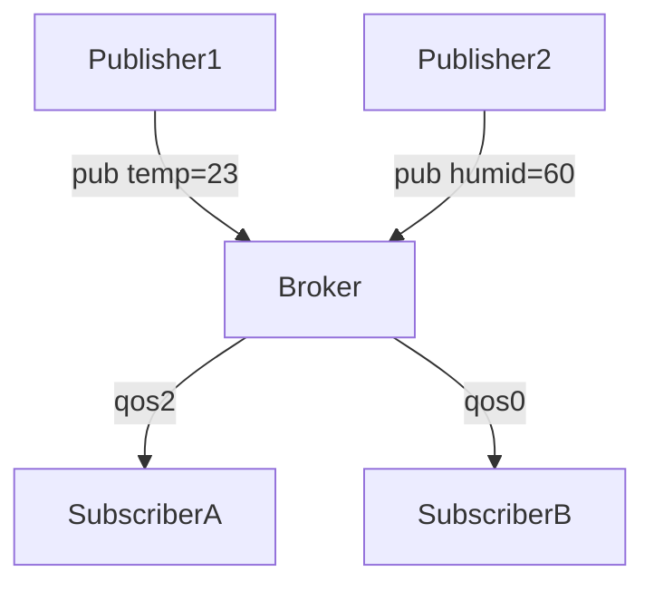
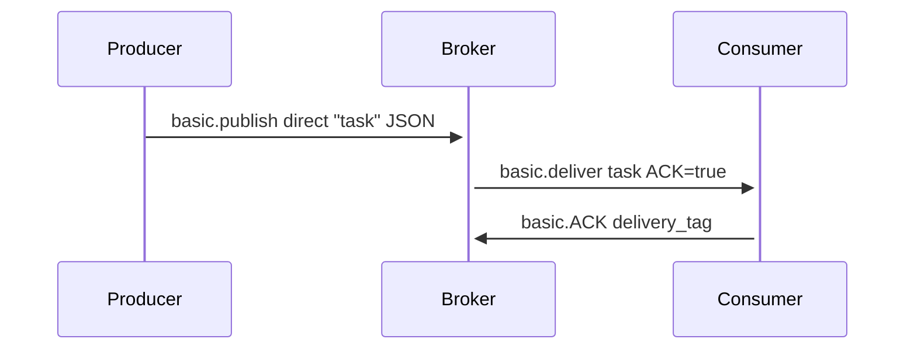
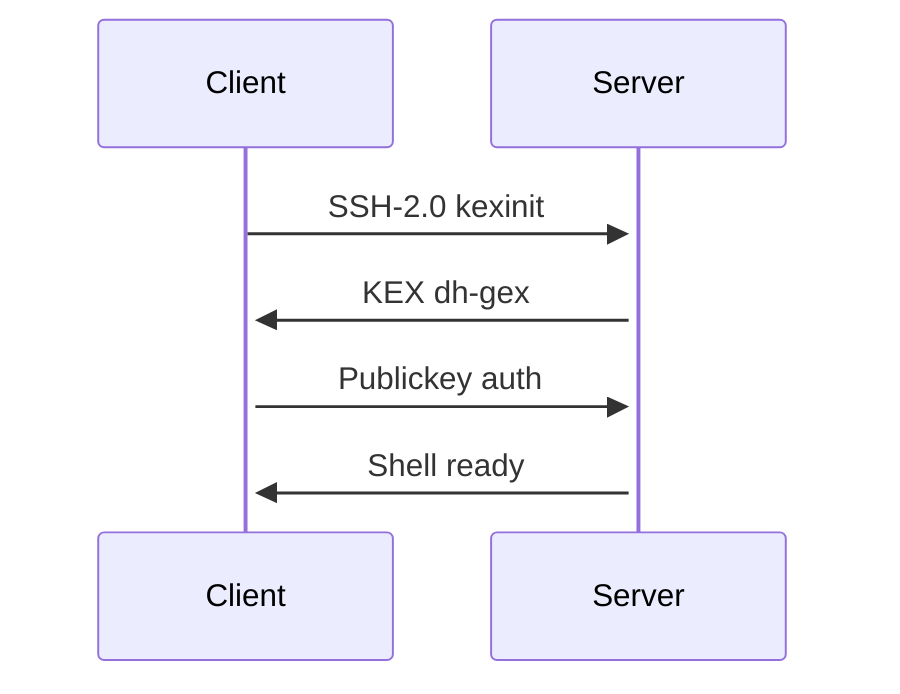
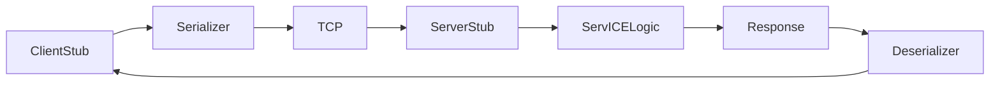

# application layer protocols

## 0. intro

application layer protocols enable software to exchange structured data over transport layers like TCP/UDP, critical for system design in APIs, streaming, and IOT scalability

## 1. HTTP

### 1.1. TF is HTTP?
- stateless request-response protocol on TCP 80/443
- text-based, method URI version crlf headers crlf body
- HTTP/1.1 pipelining, HTTP/2 binary framing/multiplexing, HTTP/3 quic UDP

### 1.2. how TF does HTTP work?
- client: get /api/users HTTP/2.0 host: example.com
- server: HTTP/2.0 200 OK content-type: application/JSON content-length: 123
- status: 2xx ok, 4xx client err, 5xx server err
- headers: cache-control max-age, etag, CORS

### 1.3. HTTP in system design
- rest APIs stateless scaling, gRPC over HTTP/2 protobuf
- rate limiting token bucket $r = \min(r + \lambda \Delta t, b)$
- CDNs edge cache TTL, anycast routing

## 2. web socket

### 2.1. TF is web socket?
- full-duplex persistent TCP connection over HTTP upgrade
- RFC6455 ws:// or WSS:// port 80/443
- frame: fin opcode(1=text,2=bin) mask payload-len payload

### 2.2. how TF does websocket work?
- handshake: GET /chat ws:// HTTP/1.1 upgrade: websocket sec-websocket-key: dgjh...
- 101 switching protocols sec-websocket-accept: SHA1(key+"258eaf...")
- bidirectional frames, ping/pong heartbeats, close 1000 normal

### 2.3. websocket in system design
- real-time chat, live updates, stock tickers
- pub/sub via redis → socket.io fanout
- scale with L7 load balancer sticky sessions

## 3. webRTC

### 3.1. TF is webRTC?
- peer-to-peer audio/video/data over UDP NAT traveRSAl
- APIs: getusermedia, rtpeerconnection, RTCdata channel
- mandatory DTLS-SRTP encryption, ICE stun/turn

### 3.2. how TF does webRTC work?
- offer/sdp: v=0 m=video 9 UDP/turn:relay rtp/h264
- ICE candidates: host 192.168.1.2:5004 srflx stun:pubip:port
- signaling via websocket/sip, trickle-ICE async candidates

### 3.3. webRTC in system design
- video calls, p2p file transfer, lan gaming
- SFU/MCU media servers for n>2 scale
- turn relays 10-20% traffic, stun free public

## 4. MQQT

### 4.1. TF is MQQT?
- lightweight pub/sub for IOT over TCP 1883/8883TLS
- qos 0 at-most-once, 1 at-least-once, 2 exactly-once
- topics: sensor/+/temp wildcards + # multi-level

### 4.2. how TF does MQQT work?
- connect: clientid clean/will topic qos retain
- publish: topic payload dup qos retain
- subACK, pubACK/pubrec/pubrel/pubcomp for qos1/2

### 4.3. MQQT in system design
- edge devICEs → broker (mosquitto, VerneMQ) → apps
- retained last will for liveness, $sys/broker/uptime metrics
- bridge clusters for ha, 100k qps scale

## 5. AMQP

### 5.1. TF is AMQP?
- advanced message queuing protocol 0-9-1 binary
- entities: exchange routekey queue binding
- fanout direct topic headers routing

### 5.2. how TF does AMQP work?
- basic.publish exchange="" routing_key="q" body
- exchange → queue → basic.consume ACK/nACK requeue
- transactions, publisher confirms, TTL/mirror queues

### 5.3. AMQP in system design
- rabbitMQ activeMQ, celery tasks, microservICEs events
- dead letter exchanges retries, sharding by consistent hash
- quorum queues raft replication

## 6. SMTP

### 6.1. TF is SMTP?
- simple mail transfer protocol TCP 25/587/465TLS
- text RFC5321 ehlo mail from: rcpt to: data .\r\n quit

### 6.2. how TF does SMTP work?
- 220 server ready → ehlo domain → 250 ok → mail from:<user@example.com>
- rcpt to:<dest> → data → subject: hello .\r\n → 250 queued
- store-and-forward via mx dns records

### 6.3. SMTP in system design
- postfix sendmail transactional emails
- dkim spf dmare arc anti-spam, rate limit 10/min/ip
- queue retry exponential backoff 4h max

## 7. IMAP

### 7.1. TF is IMAP?
- internet message access protocol TCP 143/993TLS
- synchronises folders/flags across clients
- uidvalidity uidnext prevents dup fetches

### 7.2. how TF does IMAP work?
- login → select inbox → fetch 1:10 RFC822 → store 5 \seen
- idle push notifications, compress deflate
- search charset body sentbefore 2026-01-01

### 7.3. IMAP in system design
- dovecot cyrus, mobile/webmail sync
- NSQ sharding by user hash mod n, active/active geo
- 10k concurrent idles/pod k8s

## 8. POP3

### 8.1. TF is POP3?
- post office protocol v3 TCP 110/995TLS download-and-delete
- simpler IMAP, single device access

### 8.2. how TF does POP3 work?
- user/pass → stat → list → retr 1 → dele 1 → quit
- top preview headers+100bytes, capap extensions

### 8.3. POP3 in system design
- legacy migrations, offline thick clients
- leave-on-server cap, but IMAP preferred

## 9. FTP

### 9.1. TF is FTP?
- file transfer protocol TCP 21 ctrl 20 data
- active: server→client n port, passive: client→server pasv epsv

### 9.2. how TF does FTP work?
- user/pass → pasv 227 entering passive (ip,port) → stor/rest file
- binary ascii modes, mlst mdtm facts

### 9.3. FTP in system design
- VSFTPD PROFTPD, SFTP/SCP modern secure replacement
- firewall NAT passive mode, TLS FTPs explicit/implicit

## 10. SSH

### 10.1. TF is SSH?
- secure shell TCP 22, key exchange encryption tunnel
- RFC4251-4: diffie-hellman RSA/ED25519 host keys

### 10.2. how TF does SSH work?
- clienthello kex dh-gex-SHA256 → serverhello newkeys
- auth: publickey password gssAPI → shell/exec sFTP
- channels pty forwarding agent socks

### 10.3. SSH in system design
- openSSH dropbear bastion jumps, certificate auth
- hpn-SCP high-perf, autossh tunnel ha
- git SSH keys, wireguard VPN alt

## 11. RPC

### 11.1. TF is RPC?
- remote procedure call binary over TCP/UDP/HTTP
- gRPC protobuf HTTP/2, thrift compact, avro schema

### 11.2. how TF does RPC work?
- stub serialises args → transport → server stub deserialise invoke → return
- idempotency keys, deadlines, retries exponential 2^x * base

### 11.3. RPC in system design
- microservices sync APIs, service mesh envoy proxy
- circuit breaker hystrix 50% failure → open 30s
- load balance round-robin, leastconn, consistent hash

