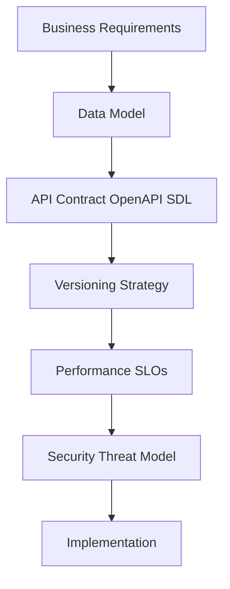
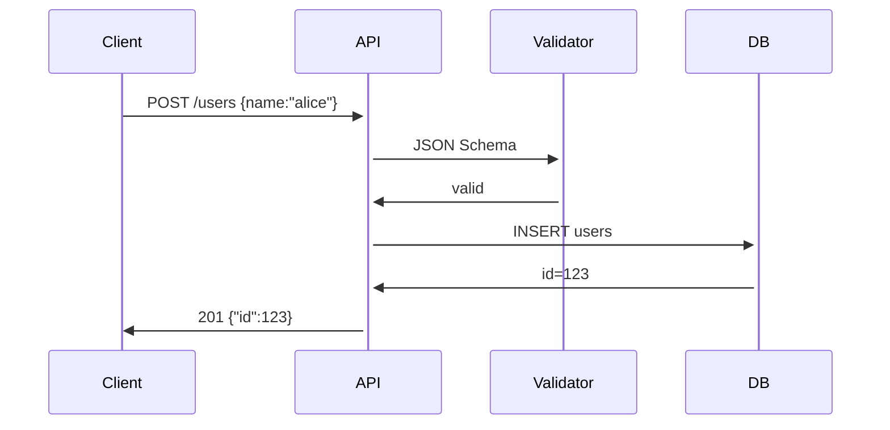
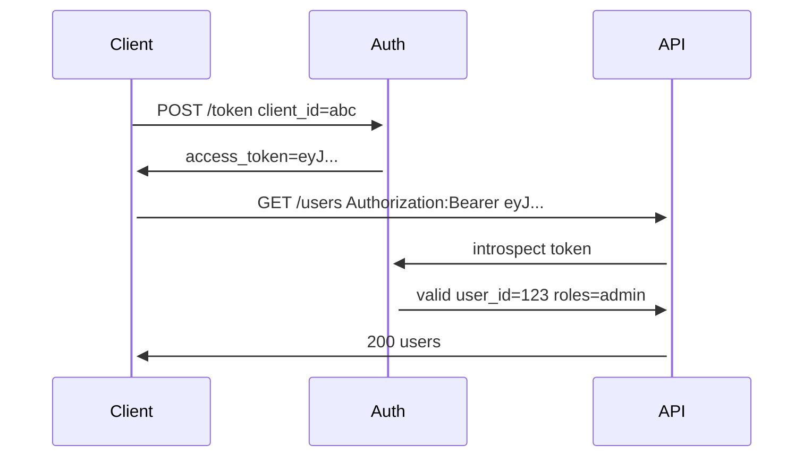
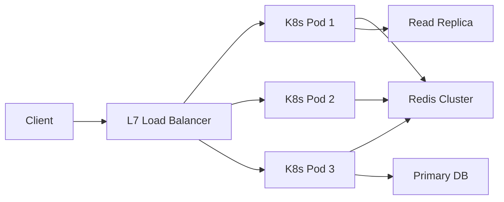
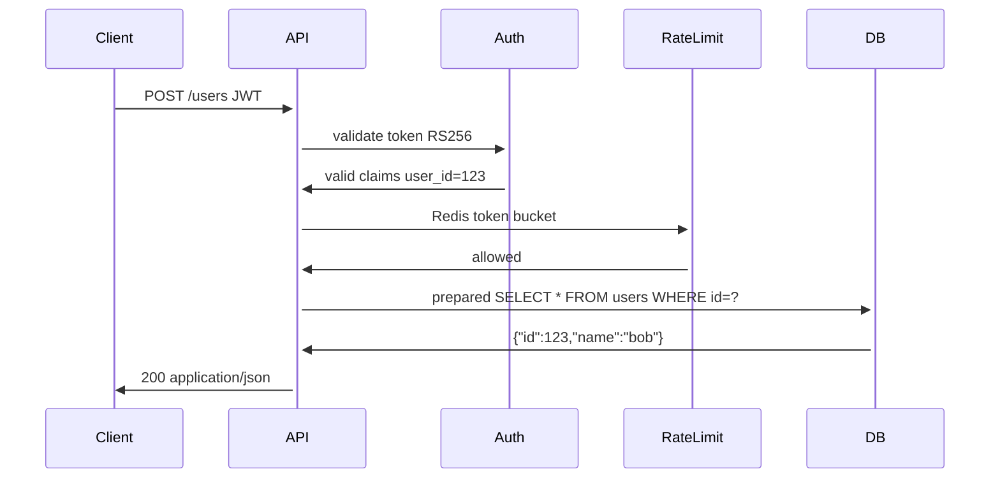

# API design

<div style="text-align: justify">

## 0. intro

APIs drive system design by standardising inter-service communication in distributed architectures from monoliths to microservices meshes enabling loose coupling scalability observability

### 0.1. WTF is an API?
- application programming interface defines contract for software components to interact
- exposes endpoints methods payloads responses for clients to invoke server logic
- abstracts implementation details hides database schemas business logic behind uniform facade
- enables loose coupling independent deploys polyglot services client-driven evolution
- versioning contracts openAPI swagger json schema evolution without breaking changes
- monitoring metrics traces opentelemetry semantic conventions for observability
- contract testing pact evans consumer-driven contracts CD/CID

### 0.2. types of APIs
- public/open APIs for external developers twitter stripe stripe connect
- private/internal APIs for microservices orchestration service mesh internal RPC
- partner APIs &rarr; RESTricted B2B integrations OAuth2 client credentials mTLS
- composite APIs aggregate multiple backends API gateway facade pattern backend-for-frontend
- partner APIs &rarr; revenue sharing usage metering stripe connect plaid
- async APIs &rarr; webhooks kafka topics SQS SQS FIFO

### 0.3. where TF are APIs used?
- web/mobile apps consume REST gRPC backends &rarr; React, Nextjs, iOS, Swift, Kotlin
- serverless functions trigger via HTTP events &rarr; AWS lambda API gateway azure functions
- IoT gateways MQTT-to-HTTP bridge edge computing AWS IoT core azure IoT hub
- service meshes envoy proxies L7 routing traffic management Istio linkerd consul connect
- CI/CD pipelines webhook APIs github actions jenkins webhook stripe webhooks
- blockchain RPC providers &rarr; infura, alchemy, JSON-RPC, eth_call

### 0.4. API paradigms
- TF is an API paradigm?
    - defines architectural style for request-response patterns serialisation routing
- standardised conventions for contracts payloads error handling versioning discovery

| paradigm | transport | serialisation | strengths | weaknesses | use cases |
|----------|-----------|---------------|-----------|------------|-----------|
| REST | HTTP/1.1 HTTP/2 HTTP/3 | JSON XML HAL JSON:API | cacheable stateless HATEOAS browser native | over/under fetching chatty N+1 | web APIs CRUD public APIs |
| SOAP | HTTP TCP | XML WSDL | WS-* standards enterprise transactions security | verbose bloat WSDL hell tooling lock-in | banking legacy .NET Java |
| gRPC | HTTP/2 | Protobuf | perf compact streaming bidirectional codegen | protobuf lock-in HTTP/2 req browser shim | microservices internal RPC mobile |
| GraphQL | HTTP/1.1 HTTP/2 WebSocket | JSON SDL | flexible client-driven batch introspection | N+1 problem cache complexity learning curve | flexible UIs dashboards admin |

#### 0.4.1. REST
- resources URIs HTTP GET POST PUT DELETE PATCH
- HATEOAS links discoverability JSON:API spec HAL embedded
- OpenAPI Swagger YAML docs codegen client/server stubs
- content negotiation accept:application/json media types
- conditional requests ETag If-None-Match If-Match If-Modified-Since
- json:API relationships include=author.comments

#### 0.4.2. SOAP
- WSDL contracts RPC/document literal envelope/body/fault
- WS-Security WS-* addressing reliable messaging policy
- legacy Java .NET enterprise SOAPUI Postman SOAPUI
- MTOM XOP binary attachments WS-AtomicTransaction XA
- UDDI service registry enterprise service bus ESB
- WS-Federation SAML enterprise identity

#### 0.4.3. gRPC
- protocol buffers schema evolution HTTP/2 multiplexing
- unary streaming server-streaming client-streaming bidirectional-streaming
- Envoy Istio proxies Tonic Rust gRPCurl CLI gRPC_health_probe
- interceptors metadata deadlines cancellation tokens
- reflect protobuf service discovery dynamic clients
- gRPC-gateway REST bridge swagger docs

#### 0.4.4. graphQL
- strongly-typed schema SDL queries mutations subscriptions
- SDL introspection fragments directives @skip @include @deprecated
- Apollo Federation GraphQL Gateway schema stitching
- persisted queries automatic codegen apollo client relay
- dataloader batching N+1 cache-first directives
- subscriptions websocket phoenix channels absinthe

## 1. pre-requisites

### 1.1. best practices before design
- define purpose use cases personas SLAs SLOs error budgets
- plan backwards compatibility semantic versioning &rarr; `/v1/users`, `/v2/users`
- evaluate tech Protobuf vs JSON, Go vs Node, Rust vs Python
- choose protocol HTTP/2, QUIC WebSockets, TCP, gRPC-Web
- model data schemas relationships cardinality one-to-many constraints
- address pagination offset cursor-based keyset infinite scroll relay-style
- optimise performance caching ETag lazy relational loads read replicas

| consideration | questions | techniques |
|---------------|-----------|------------|
| versioning | how detect breaking changes? | semver /v1 /v2 field masking |
| pagination | large result sets? | offset limit cursor after:"eyJ..." first:50 |
| performance | latency throughput? | compression gzip brotli CDN edge compute |
| security | threat model authz? | STRIDE DREAD OWASP API checklist |

$$throughput = \frac{requests}{RTT + service\_time} \cdot min(cwnd, rwnd)$$



## 2. inputs and outputs

### 2.1. inputs
- query params &rarr; ?limit=10&sort=created_desc&filter=status:active
- path params &rarr; /users/{id}/posts/{postId}?include=author comments
- JSON body &rarr; {"name":"alice" "tags":["go","API"] "metadata":{}}
- headers &rarr; X-API-Key Content-Type Authorization X-Forwarded-For
- multipart/form-data &rarr; file uploads boundary encoded fields
- cookies session management &rarr; CSRF protection HttpOnly Secure

### 2.2. outputs
- JSON HAL+JSON JSON:API embedded resources links
- status codes 201 Created Location header, 429 Retry-After
- pagination links &rarr; next/prev first/last X-Total-Count X-Page
- errors {"code":400 "message":"invalid email" "field":"email"}
- structured logging &rarr; request_id traceparent correlation_id
- open telemetry spans attributes http.method http.status_code

| input type | example | validation | security |
|------------|---------|------------|----------|
| query | ?limit=10 | int 0-100 | SQL injection XSS |
| path | /users/123 | uuid int | path traversal |
| body | {"email":"a@b.com"} | json schema | size limits prototype pollution |
| header | X-API-Key: abc123 | regex hmac | API key leakage |



## 3. CRUD ops

### 3.1. TF is CRUD?
- create read update delete
- core data operations
- maps HTTP `POST`, `GET`, `PUT`/`PATCH`, `DELETE`
- atomic transactions ACID optimistic locking versioning
- soft deletes status=deleted archival policies
- bulk operations batch create read-many idempotency keys

### 3.2. CRUD per paradigm

#### 3.2.1. REST CRUD

```plaintext
    POST /users → 201 {"id":1 "name":"alice" "_links":{"self":"/users/1"}}
    GET /users/1 → 200 user JSON ETag:"abc123"
    PUT /users/1 → 200 full update If-Match:"abc123"
    PATCH /users/1 → 200 partial {"email":"bob@example.com"}
    DELETE /users/1 → 204 no content audit log
    GET /users?limit=10&after="eyJ..." → 200 array X-Total-Count:500
```

#### 3.2.2. SOAP CRUD

```xml
    <CreateUserRequest><User><Name>alice</Name><Email>a@b.com</Email></User></CreateUserRequest>
    <CreateUserResponse><UserId>1</UserId></CreateUserResponse>
    <GetUserRequest><UserId>1</UserId></GetUserRequest>
    <GetUserResponse><User><Id>1</Id><Name>alice</Name></User></GetUserResponse>
```

#### 3.2.3. gRPC CRUD

```proto
    service Users {
    rpc Create(CreateRequest) returns (User) {}
    rpc Get(GetRequest) returns (User) {}
    rpc Update(UpdateRequest) returns (User) {}
    rpc Delete(DeleteRequest) returns (google.protobuf.Empty) {}
    rpc List(ListRequest) returns (ListResponse) {}
    }
    message CreateRequest { string name = 1; string email = 2; }
```

#### 3.2.4. graphQL CRUD

```graphql
    mutation { createUser(input:{name:"alice" email:"a@b.com"}) { id name email } }
    query { user(id:1) { id name email posts { title } } }
    mutation { updateUser(id:1 input:{name:"bob"}) { id name } }
    mutation { deleteUser(id:1) { success deletedId } }
    query { users(first:10 after:"eyJ...") { edges { node { id name } } pageInfo { hasNextPage } } }
```

## 4. auth

### 4.1. mechanisms
- API keys simple ip whitelisting header bearer
- JWT stateless HS256/RS256 claims exp iat aud iss
- OAuth2 authorisation code PKCE scopes refresh tokens
- mTLS client certs mutual auth zero trust
- OPA Rego policies fine-grained RBAC ABAC

### 4.2. flows

```plaintext
    client → /token grant_type=client_credentials scope=read:users → access_token
    bearer eyj... → /users → introspect/decode/validate → claims → policy → 200 data
```

- introspection endpoint /OAuth/introspect token validation
- jwt validation kid jwks_uri rs256 public key
- session management redis store sliding expiration

| auth method | state | security | use case |
|-------------|-------|----------|----------|
| API key | stateless | low | internal services |
| JWT | stateless | medium | SPAs mobile |
| OAuth2 | hybrid | high | third-party auth |
| mTLS | stateless | highest | B2B zero trust |



## 5. performance

### 5.1. query performance
- indexes btree gin jsonb pg_trgm postgres
- query plans EXPLAIN ANALYZE joins seqscan indexscan
- read replicas geo-partitioning sharding hash(key)
- connection pooling pgbouncer pgcat 10k connections

### 5.2. caching lazy pagination
- Redis memcached ETag If-None-Match If-Modified-Since
- dataloader GraphQL N+1 batching cache-first
- cursor-based pagination after:"eyJ..." first:50
- CDNs Cloudflare Akamai edge compute workers

### 5.3. concurrency threading parallelism
- Go goroutines 1M+ connections M:N scheduling
- Tokio Rust async Node clusters PM2
- threadpool fixed workers work-stealing Java ForkJoinPool
- G1 GC pauses batch commits WAL async

### 5.4. load balancing
- L4 TCP leastconn consistent-hash ring
- L7 HTTP path prefix host header regex
- anycast DNS global LB Envoy weighted round-robin

| technique | layer | algorithm | scale |
|-----------|-------|-----------|-------|
| connection pooling | app | pgbouncer | 10k conn |
| read replicas | db | pg logical | 99.99% read |
| CDN | L7 | anycast PoP | global latency |
| Envoy | L7 | weighted RR | 1M req/s |



## 6. security

### 6.1. rate limiting
- token bucket $tokens = \min(tokens + rate \cdot \Delta t, capacity)$
- fixed window 1000/hr leaky bucket smoothing
- distributed Redis INCRBY 60s EXPIRE lua script

### 6.2. cors
- Access-Control-Allow-Origin * specific domains
- preflight OPTIONS credentials:true max-age
- strict HTTPS only WSS:// no null origin

### 6.3. sqli xmli injections
- prepared statements `$stmt→bind_param()` parameterised queries
- ORM escapes `htmlescape`, `json_encode`, `htmlspecialchars`
- WAF ModSecurity OWASP CRS ruleset

### 6.4. OWASP top 10 2024/2025
- broken access control path traversal IDOR
- cryptographic failures TLS1.3 forward secrecy
- injection LFI RFI SSTI NoSQL GraphQL
- insecure design mass assignment API logic
- security misconfig default creds CORS wildcards

### 6.5. dependency vulnerabilities
- Dependabot, Snyk, Renovate &rarr; auto PRs
- SBOM, CycloneDX, Trivy, Grype &rarr; scans
- Sigstore, Cosign, Fulcio, Rekor &rarr; transparency

### 6.6. XSS etc
- CSP nonce hash strict-dynamic script-src 'self'
- sanitise DOMPurify validator.js bleach python
- secure headers XFO HSTS X-Content-Type-Options

| threat | mitigation | header/tool |
|--------|------------|-------------|
| XSS | CSP DOMPurify | Content-Security-Policy |
| SQLi | prepared stmts | PDO pg_query_params |
| CORS | strict origins | Access-Control-Allow-Origin |
| CSRF | synchroniser token | X-CSRF-Token |



</div>
