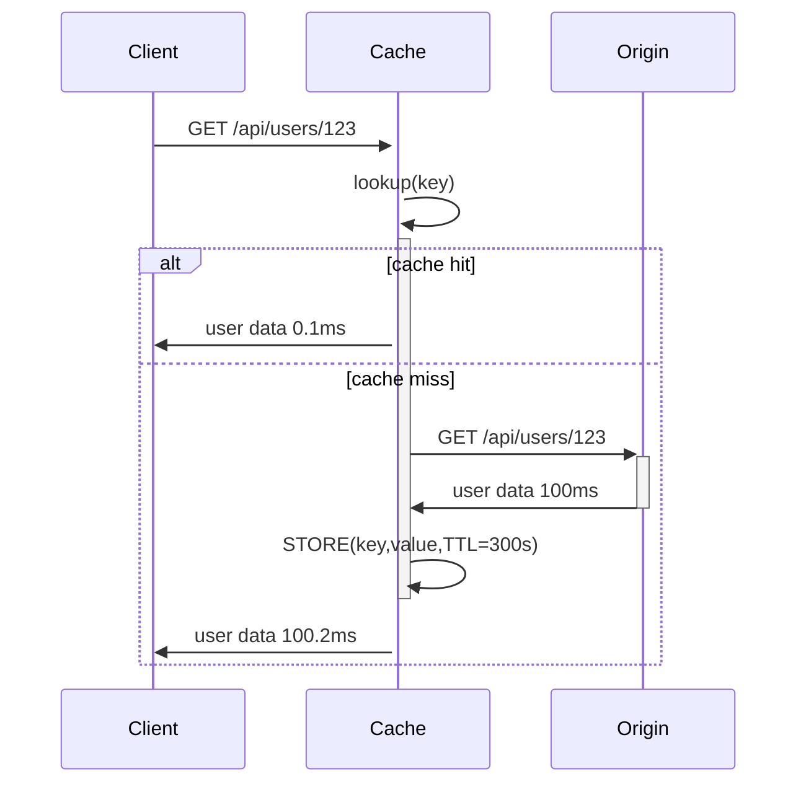
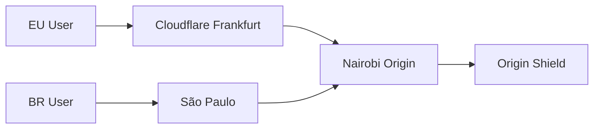
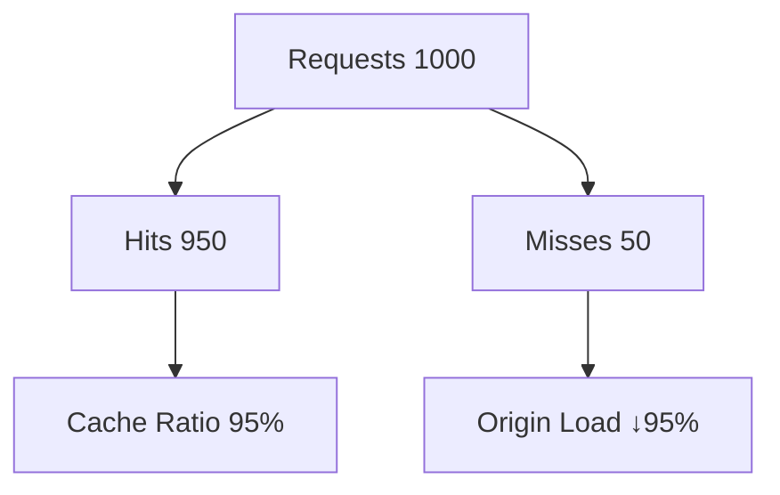
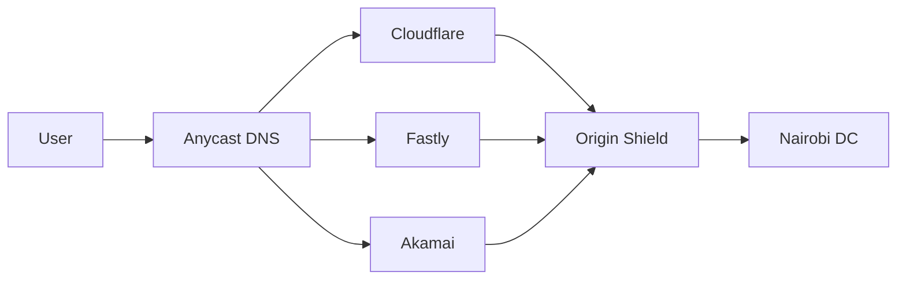

# caching and CDNs

<div style="test-align: justify;">

## 0. intro

* say we have an app hosted on servers in a data centre in Nairobi
    - latency to Dakar/Durban users ~100ms due to 5-7k km fibre paths
    - latency to Salvador da Bahia users 3-5s roundtrip transatlantic + south america hops
    - strategies to minimise latency include caching CDNs edge computing anycast routing
* enter caching and CDNs
    - caching stores computed results reducing recomputation latency
    - CDNs distribute content geographically minimising RTT bandwidth costs

## 1. WTF is caching?

* define cache from a computing perspective
    - temporary high-speed storage layer holding frequently accessed data
    - bridges slower backend systems (disk DB) with faster consumers (CPU RAM)
    - exploits temporal locality (recently used) spatial locality (nearby data)

* define caching as a latency-reducing strategy
    - avoids expensive recomputation by reusing prior results
    - hit ratio >90% yields near-instant responses vs origin latency
    - memory-speed reads vs disk/network I/O by factor 100-1000x

### 1.1. how TF does a cache work?
- key-value store key → value TTL eviction metadata
- read: lookup(key) → hit(value) miss(origin→store→return)
- write: store(key,value) invalidate dependent keys
- consistency models: cache-aside read-through write-through write-behind



### 1.2. where TF is caching useful?
- database query results `SELECT * FROM users WHERE active=1`
- computed values fibonacci tax calculations image thumbnails
- API responses paginated lists search results recommendations
- session data user preferences shopping carts auth tokens

## 2. methods of caching

### 2.1. browser caching
- client-side storage of static assets CSS, JS, images, fonts
- reduces repeat downloads for returning visitors offline access
- useful for infrequently changing assets marketing sites docs

- storage: memory cache, disk cache, service workers, IndexedDB, LocalStorage
- devtools network tab: (memory cache) (disk cache) from serviceworker
- headers Cache-Control:`max-age=3600 Expires:abs-date ETag:"v123"`
- validation `If-None-Match`, `If-Modified-Since`, `304 Not Modified`

| aspect | pros | cons |
|--------|------|------|
| performance | instant loads repeat visits | first visit full download |
| storage | automatic quota management | user clear cache breaks |
| control | granular headers per-asset | version changes stale risk |
| privacy | local first-party only | fingerprinting surface |

### 2.2. server caching
- application/database layer stores computed results fragments
- useful for dynamic content expensive queries high traffic
- reduces origin server CPU DB connections origin requests

- in-memory Redis memcached 100ns-10μs latency 1M+ ops/sec
- persistent disk redis AOF RDB memcached ephemeral
- distributed hash ring consistent hashing sharding

- write-through: write(cache+origin) sync consistent low latency writes
- write-back: write(cache) async origin high write throughput eventual
- write-around: origin only cache read expensive writes (logs analytics)

| eviction | formula | use case |
|----------|---------|----------|
| LRU | remove least recently used | web pages sessions |
| LFU | remove least frequency | static assets APIs |
| FIFO | first in first out | bounded streams logs |
| random | O(1) sample replace | approximate good enough |

### 2.3. database caching
- query resultsets execution plans temp tables stored procedures
- useful for read-heavy workloads reports aggregations searches
- postgres `shared_buffers`, `pg_bouncer`, connection pool cache

- buffer pool RAM→disk page cache kernel→user space
- query cache mysql deprecated → redis memcached external
- materialised views postgres incremental refresh scheduled

- ARC adaptive replacement cache dual LRU lists
- clock/probabilistic counting bloom filter approximate

| layer | latency | consistency | scale |
|-------|---------|-------------|-------|
| buffer pool | 100μs | strong | single node |
| query cache | 1ms | eventual | multi-node |
| app redis | 500μs | tunable | distributed |

### 2.4. CDN
- content delivery network global PoPs edge servers origin pull
- useful static assets media streaming dynamic content (edge compute)
- origin authoritative source purge invalidation propagation

- pull: edge miss → origin fetch cache TTL 95% hit global
- push: origin proactively publishes multiple edges instant updates
- origin shield single pull target origin protection cache aggregation

| model | latency | update speed | complexity |
|-------|---------|--------------|------------|
| pull | good 95% hit | TTL purge | simple |
| push | instant | real-time | origin → 100s edges |
| shield | origin protection | aggregated cache | multi-tier |



## 3. metrics

### 3.1. cache ratio
- cache hit: served from cache instant low latency
- cache miss: origin fetch cold start latency spike
- cache ratio = hits/(hits+misses) target >95% for static >80% dynamic

$$cache\_hit\_ratio = \frac{hits}{hits + misses} \times 100\%$$

- latency P50 P95 P99 origin time cache time
- throughput req/sec saved origin traffic GB saved
- staleness average age vs TTL max-age violation rate
- eviction churn rate memory usage fragmentation

| metric | target | action |
|--------|--------|---------|
| hit ratio | >95% | increase TTL add keys |
| P95 latency | <100ms | shard upstream capacity |
| memory | <80% | evict earlier scale nodes |
| churn | <10%/hr | tune eviction key patterns |



## 4. cache stampede prevention

### 4.1. stampede problem
- n servers cache key TTL=300s all expire simultaneously
- n parallel origin requests overload backend CPU/DB
- dog-pile effect cascading failure 1000→10000 req/s spike

### 4.2. strategies
- singleflight/locking: acquire mutex → compute → release (go sync.Map)
- stale-while-revalidate: serve stale + async refresh
- early recompute probabilistic TTL jitter [mikejohnson][def]

## 5. probabilistic TTL

### 5.1. early refresh math
- probability refresh = $\left( \frac{t - t_0}{TTL} \right)^\beta$ where $\beta=1.5-2$
- spreads refreshes ramp-up final 20% TTL vs sharp expiry spike
- expected stampede size ~ $e^{\Omega(1/\epsilon)}$ uniform vs exponential optimal [vldb][def2]

$$P(refresh) = \min\left(1, \left( \frac{age}{TTL} \right)^\beta \right)$$

- jitter TTL ±10-20% uniform(0.8*TTL, 1.2*TTL) prevents fleet sync
- XFetch Exp($\lambda=1/\beta$) optimal gap $O(\log n)$ stampede $O(1)$ [mikejohnson][def]

### 5.2. implementation

```python
    if rand() < (now() - created_at)/TTL ** 1.5:
        async refresh(key)  # background
    return cached_value
```

| beta | early gap | stampede reduction |
|------|-----------|--------------------|
| 1.0 | 30s early | 60x peak load ↓ |
| 1.5 | 15s early | 100x optimal |
| 2.0 | 5s early | conservative fresh |

## 6. multi-CDN architecture

### 6.1. traffic steering
- anycast DNS → nearest PoP Cloudflare+Fastly+Akamai
- health checks GSLB failover 99.999% uptime
- cost routing cheapest healthy provider dynamic

### 6.2. topologies
- single CDN simple 99.99% one failure domain
- multi-CDN resilience header routing `X-CDN:fastly`
- origin shield tiered caching → single origin pull



## 7. Redis vs Memcached

| feature | Redis | Memcached |
|---------|-------|-----------|
| data types | strings lists sets hashes pub/sub | strings only K/V |
| persistence | RDB AOF | none ephemeral |
| eviction | allkeys-lru volatile-lfu | lru only |
| replication | master-slave sentinel cluster | none |
| latency | 100μs Lua scripting | 50μs simpler |
| scale | 1TB+ sharding | 100GB/node |

- Redis: sessions queues leaderboards geospatial
- Memcached: pure cache simple high-throughput

## 8. DB query cache invalidation

### 8.1. patterns
- write-through: invalidate on UPDATE INSERT DELETE
- tags Redis SET tags:user:123 del tags:* → multi del keys
- pub/sub channel "user:updated:123" → subscribers invalidate
- multi-level: app→redis→db materialised view refresh

### 8.2. strategies

```plaintext
    UPDATE users SET name=? WHERE id=?
    → redis.DEL "user:{id}"
    → redis.SREM "tags:active" "user:{id}"
    → redis.PUBLISH "user:updated:{id}" payload
```

- cache-aside app logic if !cache.get → db→cache.set
- read-through db proxy (planetscale vitess) transparent
- invalidation storms → rate limit debounce tags batch

| pattern | consistency | complexity |
|---------|-------------|------------|
| write-through | strong | origin every write |
| pub/sub | eventual | fanout scale |
| tags | flexible | memory tags |


</div>


[def]: https://www.mikejohnson.dev/posts/2023/01/cache-stampede
[def2]: http://www.vldb.org/pvldb/vol8/p886-vattani.pdf