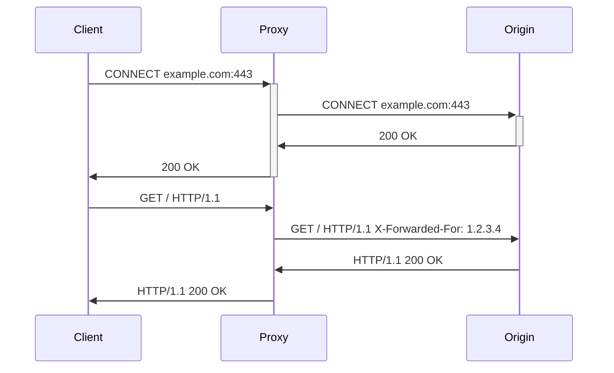
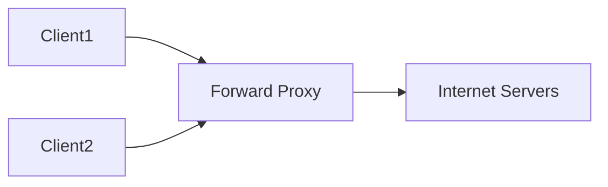
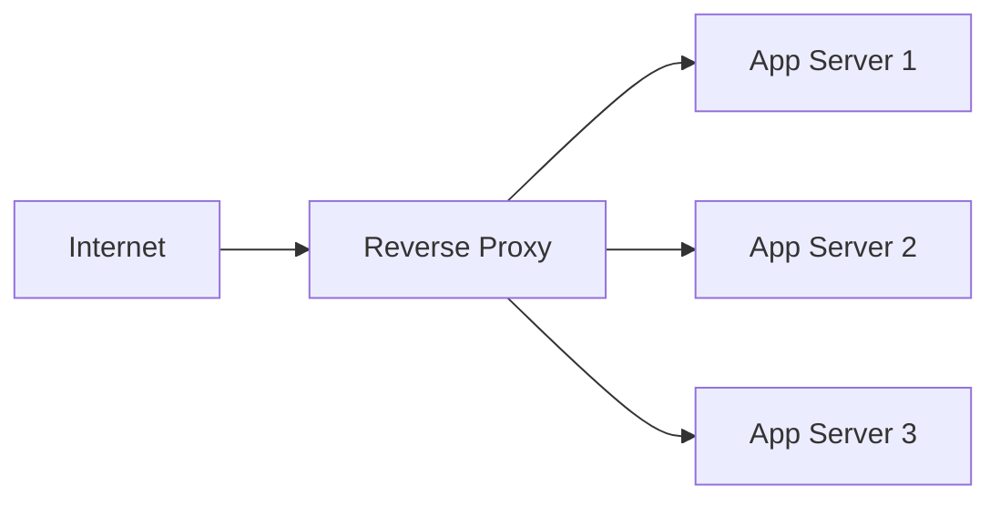
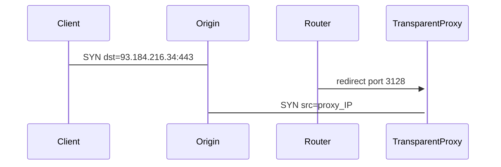
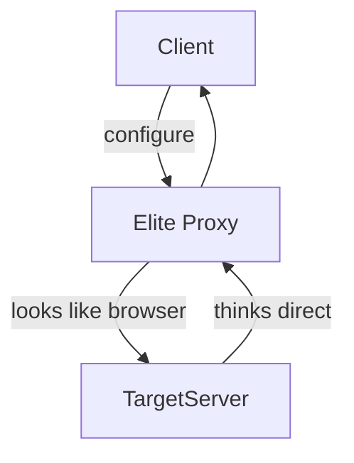

# proxy servers

<div style="text-align: jusstify;">

## 0. intro

* proxy servers act as intermediaries in network communication, critical for system design in load distribution security content filtering traffic shAPIng

### 0.1. WTF is a proxy server?
- intermediary server positioned between clients and destination servers
- receives client requests evaluates policies forwards to upstream servers
- receives upstream responses inspects modifies relays to clients
- operates at L4-L7 TCP/udp/HTTP providing visibility control transformation [networkacademy][def]

### 0.2. how TF does a proxy server work?
- client request → proxy listener → policy engine → upstream connection
- proxy establishes new TCP connection to destination uses own IP address
- request/response inspection modification caching compression
- response → proxy → client proxy terminates both connections

$$latency_{proxy} = RTT_{client-proxy} + processing + RTT_{proxy-origin}$$



### 0.3. how TF is a proxy server useful?
- security hides backend IPs WAF SQL injection XSS protection
- performance load balancing SSL termination caching compression
- monitoring logging metrics rate limiting traffic shAPIng
- access control geo-blocking content filtering URL categorization

## 1. types of proxy servers

### 1.1. forward proxy
- positioned before clients controls outbound traffic to internet
- clients explicitly configure proxy address port in browser OS settings
- visible to destination servers proxy IP appears in logs
- use cases: corporate firewalls, content filtering, URL categorisation

| feature | details |
|---------|---------|
| position | client → proxy → internet |
| client config | manual proxy.pac pac file |
| visibility | destination sees proxy IP |
| protocols | HTTP HTTPs socks5 |

**pros** central policy enforcement logging caching malware scanning
**cons** single point failure client configuration bypass risks



### 1.2. reverse proxy
- positioned before origin servers controls inbound traffic
- clients unaware of proxy connect directly to proxy DNS IP
- hides origin server IPs load balances multIPle backends
- use cases: nginx, haproxy envoy, API gateways, SSL termination [networkacademy][def]

| feature | details |
|---------|---------|
| position | internet → proxy → origin pool |
| client config | transparent DNS a-record |
| visibility | client sees proxy IP origin hidden |
| protocols | HTTP/2 gRPC websocket TCP |

**pros** hides infrastructure SSL offload WAF caching rate limiting
**cons** proxy failure blocks all traffic SSL passthrough complexity



### 1.3. open proxy
- forward proxy accessible to anyone no authentication required
- listed in public proxy lists harvested by bots scrapers
- use cases anonymous browsing bypass geo-restrictions
- high abuse potential spam DDoS amplification attacks

**pros** free easy access no configuration
**cons** slow unreliable security risk honeypot potential

### 1.4. transparent proxy
- intercepts traffic without client configuration using routing redirection
- WCCPGRE tunnels policy-based routing IPtables tproxy
- modifies traffic transparently visible to clients via TCP handshake
- use cases: ISP content filtering, corporate HTTP inspection

| interception | mechanism |
|--------------|-----------|
| L4 | IPtables REDIRECT/MANGLE |
| L7 | SSL bump man-in-middle |
| DHCP | auto proxy config DNS |

**pros** zero client config mandatory compliance
**cons** privacy concerns SSL interception breaks HSTS pinsets



### 1.5. anonymous proxy
- forward proxy identifies itself as proxy via headers
- sends via `x-forwarded-for`, `x-real-IP`, `proxy-connection`
- destination knows request proxied but not client IP
- use cases: basic privacy bypass, naive geo-blocks

**headers sent**

```plaintext
    X-Forwarded-For: client_IP
    Via: 1.1 proxy.example.com
    Proxy-Connection: keep-alive
```

**pros** hides client IP basic anonymity
**cons** detectable easily blocked proxy IP blacklisted

### 1.6. distorting proxy
- forward proxy sends incorrect client IP information
- spoofs `x-forwarded-for`, random/fake IPs
- destination confused about true client identity
- use cases: advanced privacy evasion, weak proxies

**pros** confuses logging analytics
**cons** unreliable inconsistent behaviour blocked by smart servers

### 1.7. high anonymity proxy (elite)
- forward proxy appears as regular web browser
- strIPs all proxy identifying headers completely
- destination unaware request proxied sees proxy as client
- use cases: maximum privacy, anti-fingerprinting, scraping

**headers sent**

```plaintext
    User-Agent: Mozilla/5.0 (elite proxy)
    Accept: text/html,application/xhtml+xml
    (no proxy headers)
```

| anonymity level | client IP | proxy detection | headers |
|-----------------|-----------|-----------------|---------|
| transparent | visible | visible | none |
| anonymous | hidden | visible | X-Forwarded-For |
| distorting | fake | visible | fake IP |
| elite | hidden | invisible | clean |

**pros** undetectable maximum privacy
**cons** rare expensive slower premium service



**system design considerations**
- reverse proxy + load balancer → app servers → DB (nginx → gunicorn → postgres)
- forward proxy chains socks5 → HTTPs → tor maximum anonymity
- transparent proxy + WAF → inspect all HTTP traffic modsecurity cors
- multi-tier proxy origin shield → edge proxy → origin cache aggregation

| proxy type | system design role | scale pattern |
|------------|-------------------|---------------|
| forward | outbound control | squid zscaler bluecoat |
| reverse | inbound protection | nginx haproxy envoy |
| transparent | mandatory inspect | riverbed steelbelt |
| elite | scrAPIng evasion | luminati oxylabs |

</div>


[def]: HTTPs://www.networkacademy.io/ccna/network-fundamentals/proxy-servers