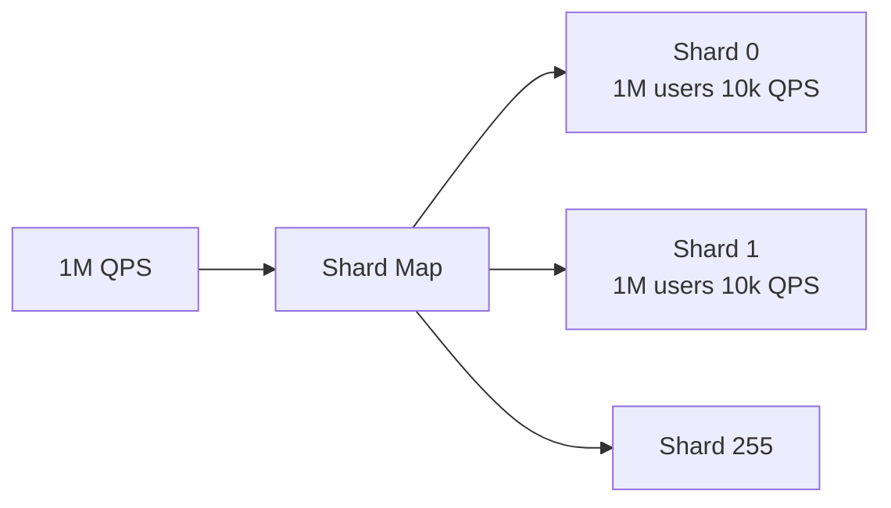
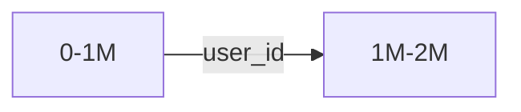
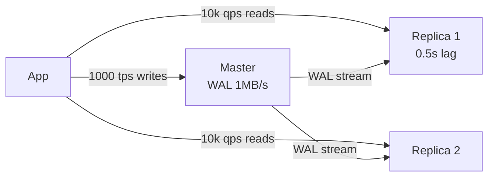
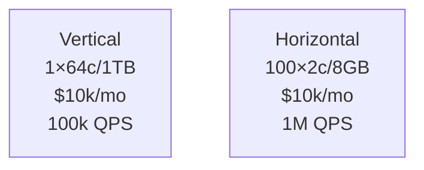
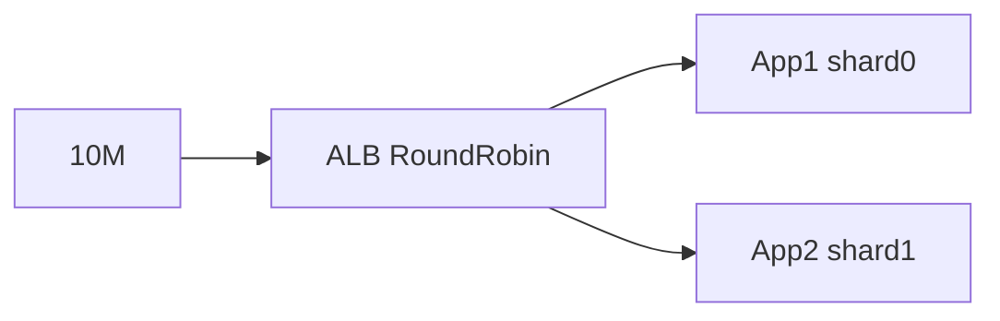
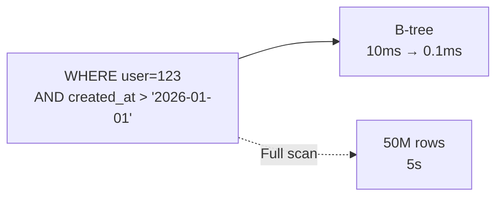
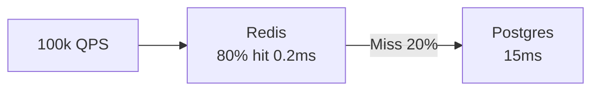
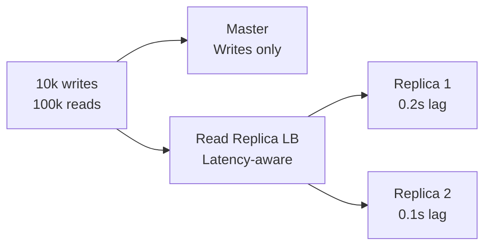

# databases

<div style="text-align: justify;">

## 0. intro

### 0.1. WTF is a database?

A database systematically organises data for efficient storage, retrieval, update, deletion using query languages, indexing, transactions.

**Key features**: persistence (non-volatile storage), ACID compliance, concurrent access (MVCC/locking), schemas (rigid/flexible), backup (full/incremental/PITR), recovery (crash/failover), indexing (B-tree/hash/GiST).

**Stats**: Global DB market $89B (2025), PostgreSQL 50% open source, MongoDB 30% document share.

**Query time**: Query time $$T_q = \frac{D}{I} + S$$ where $D$=data size, $I$=index selectivity, $S$=seek time.

**Example**: PostgreSQL e-commerce: 10M orders, B-tree on `(user_id, created_at)`, 5ms → 0.1ms queries.

### 0.2. types of DBs

```mermaid
    graph TB
        DB[Databases $89B] --> Rel[Relational SQL<br/>Postgres 50%<br/>ACID Tables Joins<br/>$T_q=O(\log n)$]
        DB --> NoSQL[NoSQL $40B] --> Doc[Document<br/>MongoDB 30%<br/>JSON Flexible]
        NoSQL --> KV[Key-Value<br/>Redis 1M ops/s<br/>O(1) lookup]
        NoSQL --> Col[Column Cassandra<br/>1PB logs/day]
        NoSQL --> Graph[Neo4j<br/>Social O(depth)]
        DB --> InMem[In-Memory<br/>Redis 0.2ms<br/>RAM-only]
        DB --> NewSQL[CockroachDB<br/>Distributed SQL]
```

#### 0.2.1. relational

**Relational databases** use tables, rows, columns, schemas, SQL, ACID transactions.

**Relational**: Foreign keys (`user_id REFERENCES users(id)`), normalisation (1NF→BCNF), joins (8 types).

```mermaid
    graph LR
        Users[Users 10M<br/>id(PK) name email] 
        -->|FK user_id| Orders[Orders 50M<br/>id(PK) user_id amount]
        Orders -->|1:M| Items[100M<br/>order_id product_id qty]
```

**Features**: $$ACID$$, SQL92/2016, B-tree indexes ($$\log_{100}N$$), constraints, stored procedures, triggers, window functions.

**Example**:
```sql
    CREATE TABLE orders (
        id BIGSERIAL PRIMARY KEY,
        user_id BIGINT REFERENCES users(id) ON DELETE CASCADE,
        amount DECIMAL(12,2) CHECK (amount > 0),
        status ENUM('pending', 'shipped')
    );
    CREATE INDEX CONCURRENTLY idx_orders_user_time ON orders(user_id, created_at);
```

**Use cases**: Banking (transactions), ERP (relations), reporting (complex JOINs).

**Pros**: Integrity (FKs), standards (SQL), mature tooling, transactions.  
**Cons**: Schema changes slow, vertical scale ($10k→$100k/server), join explosion ($O(n^2)$).

#### 0.2.2. non-relational

**NoSQL** uses flexible schemas: documents, key-value, column-family, graphs.

**MongoDB example**:
```json
    {
    "_id": ObjectId("..."),
    "user_id": 123456,
    "profile": {
        "name": "Francis",
        "preferences": {"theme": "dark", "lang": "en-GB"}
    },
    "orders": [{"id": 1, "total": 99.99, "items": 3}]
    }
```

**Features**: Horizontal scale ($100/server), BASE, schema evolution, high writes (10k+/sec/shard).

**Stats**: MongoDB $2B revenue, Cassandra 1PB+/day (Netflix).

**Use cases**: Logs (ELK), social graphs (LinkedIn), IoT (1M events/sec), CMS.

**Pros**: Schema-free, scales linearly, high throughput, variety.  
**Cons**: Eventual consistency ($CP=0$), duplication, no JOINs, query limits.

#### 0.2.3. in-memory

**In-memory** stores data in RAM, bypasses disk I/O.

**Redis patterns**:
```bash
    SETEX user:123:session 3600 "jwt..."
    ZADD rankings 1500 "user123"
    SET product:456 '{"price": 29.99}'
    PUBLISH chatroom "Hello!"
```

```mermaid
    graph LR
        App[App 100k QPS] -->|0.2ms O(1)| Redis[64GB RAM<br/>1M ops/s<br/>LRU eviction]
        App -.->|15ms| Postgres[SSD<br/>10k QPS]
```

**Features**: $O(1)$ access, persistence (AOF/RDB), eviction (LRU/LFU/allkeys-lru), replication.

**Use cases**: Sessions (1B users), leaderboards (Fortnite), real-time (trading).

**Pros**: 100x faster, pub/sub, simple model.  
**Cons**: RAM $5k/TB, restarts lose data, single-threaded Redis.

### 0.3. DML, DDL etc

| Language | Purpose | Examples | Complexity |
|----------|---------|----------|------------|
| **DDL** | Schema | `CREATE TABLE`, `ALTER ADD COLUMN`, `DROP INDEX` | $$O(n)$$ locks |
| **DML** | Data | `INSERT`, `UPDATE SET`, `DELETE`, `SELECT` | Varies |
| **DCL** | Security | `GRANT SELECT`, `REVOKE ALL` | Admin |
| **DQL** | Query | `SELECT * WHERE` | Analytical |
| **TCL** | Transactions | `BEGIN`, `COMMIT`, `ROLLBACK` | ACID |

**Transaction example**:
```sql
    BEGIN ISOLATION LEVEL SERIALIZABLE;
    UPDATE accounts SET balance = balance - 100 WHERE id = 1;
    UPDATE accounts SET balance = balance + 100 WHERE id = 2;
    COMMIT;
```

## 1. sharding

### 1.1. WTF is sharding?

**Sharding** splits data: $$shard_i = hash(key) \mod N_{shards}$$.



**Why**: Single Postgres maxes at 100k QPS, 10TB. Sharding → 25M QPS, 2.5PB.

### 1.2. strategies to achieve sharding

#### 1.2.1. hash-based sharding

$$shard = murmurhash3(user\_id) \mod 256$$
Uniform distribution (std=0.1%).

```sql
    SELECT * FROM users_42 WHERE id = 123456;  -- shard 42
```

**Pros**: Even load. **Cons**: Cross-shard JOINs impossible.

#### 1.2.2. range-based sharding

$$user\_id \in [1M,2M) → shard\_1$$

Range scans local.



**Pros**: Range queries. **Cons**: Hotspots (new users).

#### 1.2.3. composite sharding

$$shard(country, user\_id \mod 16)$$

Geo + hash.

```plaintext
    UK+user%16=3 → uk_shard_3 (London DC)
```

#### 1.2.4. directory-based sharding

Redis `HGET shard_map 123456 → "shard_42"`.

### 1.3. strategies to enforce sharding

#### 1.3.1. client-side

```go
    shard := crc32.ChecksumIEEE([]byte(userID)) % 256
    db[shard].Exec("INSERT users ...")
```

#### 1.3.2. proxy-based

```
    App → Vitess → shard.users (transparent)
```

## 2. replication

### 2.1. WTF is replication?

**Replication** copies data: master → replicas via WAL/shipping.



**Why**: 1 master = 1k writes/sec. 10 replicas = 10k reads/sec.

### 2.2. strategies to achieve replication

#### 2.2.1. master-slave

```sql
    -- Master: INSERT order (replicated async)
    -- Replicas: apply WAL (0.5s lag)
```

#### 2.2.2. master-master

```plaintext
    NodeA: order #123
    NodeB: order #123 (LAST WRITE WINS)
```

## 3. ACID

### 3.1. WTF is ACID?

**ACID** ensures reliable transactions.

#### 3.1.1. atomicity

$T = \{op_1, op_2, \ldots, op_n\}$ all succeed or rollback.

#### 3.1.2. consistency

$$\forall T, valid(state_{before}) \rightarrow valid(state_{after})$$

#### 3.1.3. isolation

Concurrent $$T_1, T_2$$ appear sequential.

#### 3.1.4. durability

$$COMMIT \rightarrow fsync(WAL)$$

### 3.2. strategies to achieve ACID

#### 3.2.1. WAL

```plaintext
    1. WAL: XID=123 "UPDATE a=42"
    2. COMMIT → fsync(WAL)
    3. Crash → replay WAL
```

## 4. scaling

### 4.1. WTF is scaling?

**Scaling** handles $$QPS_{new} > QPS_{old}$$.



### 4.2. horizontal scaling

**Add nodes**: $$Capacity_n = n \times Capacity_1$$.



**Pros**: Linear scale, HA. **Cons**: $$O(n)$$ complexity.

### 4.3. vertical scaling

**Upgrade**: 16c/64GB → 64c/1TB.

```plaintext
    QPS ∝ cores, IOPS ∝ SSDs
    Cost: $1k → $10k (+900%)
```

## 5. performance

### 5.1. strategies to achieve performance

#### 5.1.1. indexing

**Definition**: Data structures accelerating queries (B-tree, hash, GiST, GIN).

**How**: $$B-tree: T_q = O(\log_{100}N)$$ vs full scan $$O(N)$$.

```sql
    -- Composite index: (user_id, created_at, status)
    CREATE INDEX CONCURRENTLY idx_orders_composite 
    ON orders (user_id, created_at DESC) WHERE status = 'pending';
```



**Pros**: 100-1000x speedup, selective queries.  
**Cons**: Write penalty (20-50%), index bloat (2x storage), wrong index = slower.

#### 5.1.2. caching

**Definition**: Store hot data in RAM (Redis, Memcached).

**How**: Cache hit $$P_h = \frac{accesses_{hot}}{total}$$ (Zipf: 80/20).



**TTL**: $$TTL = \frac{1}{\lambda_{staleness}}$$ (staleness rate).

**Pros**: 100x faster, reduces DB load 80%.  
**Cons**: Cache stampede, memory $5k/TB, staleness.

#### 5.1.3. connection pooling

**Definition**: Reuse DB connections (PgBouncer, HikariCP).

**How**: TCP handshake 10ms + auth 5ms × 1000 conn/sec = 15s waste.

```plaintext
    No pool: 1000 conn/sec × 15ms = 15s CPU waste
    PgBouncer: 1000 conn → 10 pooled → 1000x less overhead
```

**Pros**: Connection storm protection, 10x throughput.  
**Cons**: Config complexity, stale connections.

#### 5.1.4. query optimisation

**Definition**: Rewrite queries using planner statistics.

**Before**: `SELECT * FROM orders WHERE amount > 100 ORDER BY created_at`
**After**: `SELECT id, amount FROM orders WHERE amount > 100 ORDER BY created_at LIMIT 100`

```sql
    -- EXPLAIN ANALYZE
    EXPLAIN (ANALYZE, BUFFERS) 
    SELECT id, total FROM orders 
    WHERE user_id = 123 
    ORDER BY created_at DESC 
    LIMIT 20;
```

**Pros**: 10-100x speedup, no infra cost.  
**Cons**: Requires EXPLAIN knowledge, stats maintenance.

#### 5.1.5. partitioning

**Definition**: Split table by range/list/hash (PostgreSQL declarative).

```sql
    CREATE TABLE orders (
        id BIGSERIAL,
        user_id BIGINT,
        created_at TIMESTAMPTZ
    ) PARTITION BY RANGE (created_at);

    CREATE TABLE orders_2026_01 PARTITION OF orders
    FOR VALUES FROM ('2026-01-01') TO ('2026-02-01');
```

**Pruning**: `WHERE created_at > '2026-01-15'` → 1 partition vs all.

```plaintext
    10 partitions × 5M rows = 50M → 5M scanned (90% less I/O)
```

**Pros**: Parallel scans, easier maintenance.  
**Cons**: Cross-partition queries slow, planning overhead.

#### 5.1.6. read replicas

**Definition**: Scale reads via replication lag tolerance.



**Routing**: Analytics → replicas, payments → master.

**Pros**: 10x read capacity, geo-replication.  
**Cons**: Stale reads (0.5s), failover complexity.

**Performance Matrix**:

| Strategy | Latency | Throughput | Cost | Complexity |
|----------|---------|------------|------|------------|
| Indexing | 10ms→0.1ms | 10x | Storage | Low |
| Caching | 15ms→0.2ms | 100x | RAM $5k/TB | Medium |
| Pooling | Setup 15ms→1ms | 10x | Config | Low |
| Partition | Scan 10s→1s | 10x | Schema | High |
| Replicas | Reads 15ms→5ms | 10x | Servers | High |

</div>
