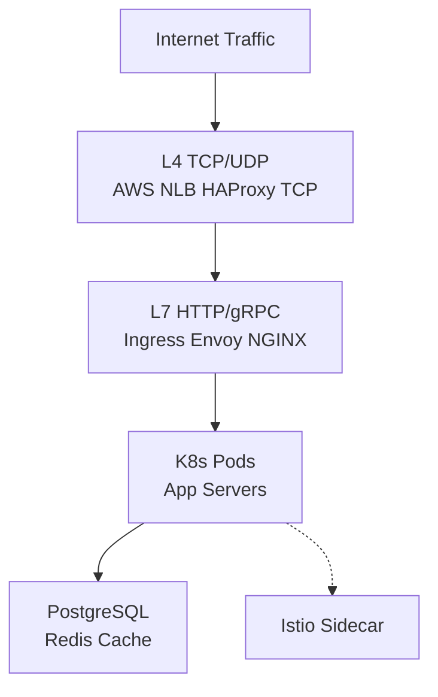
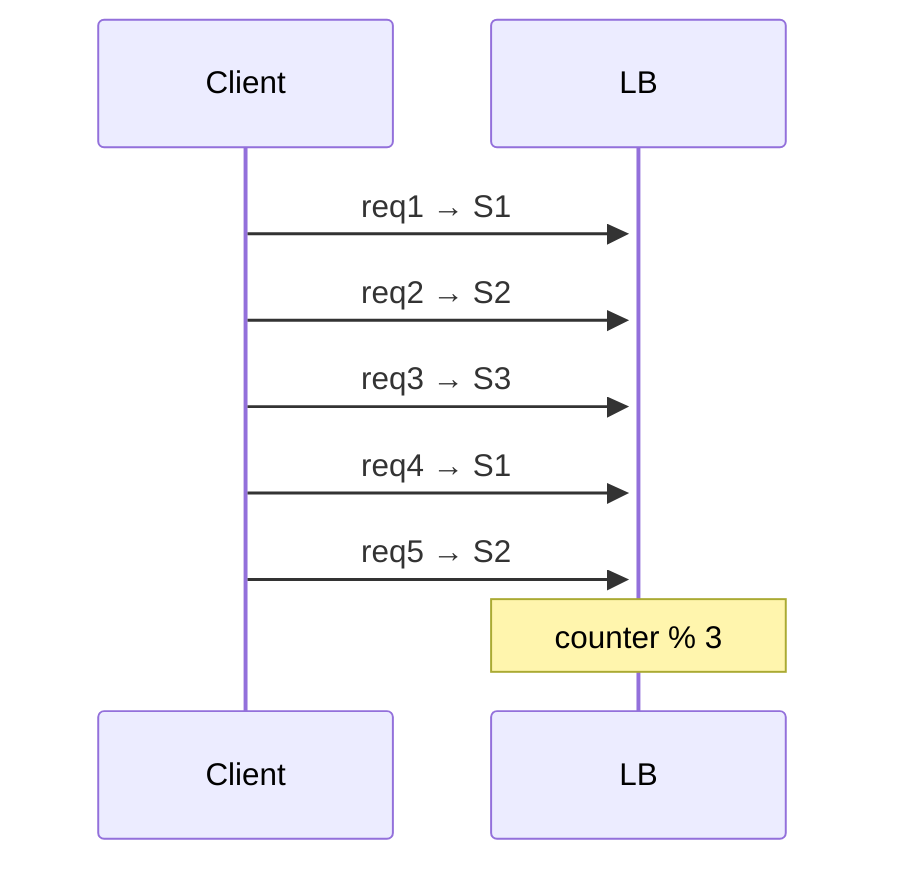
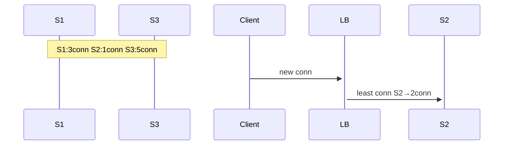
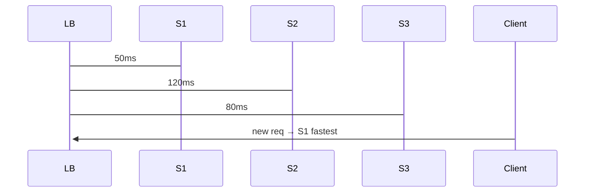
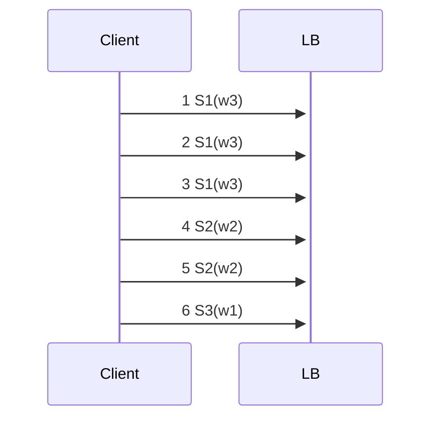
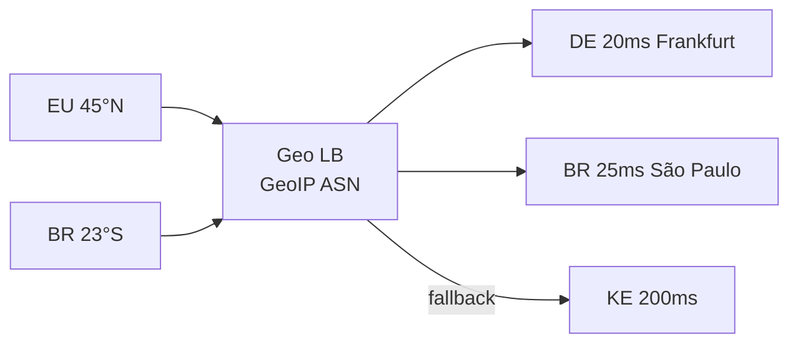
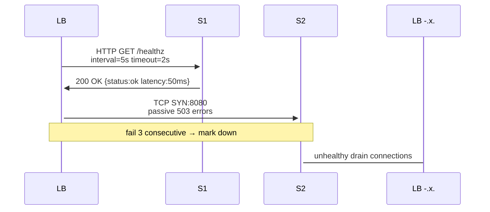
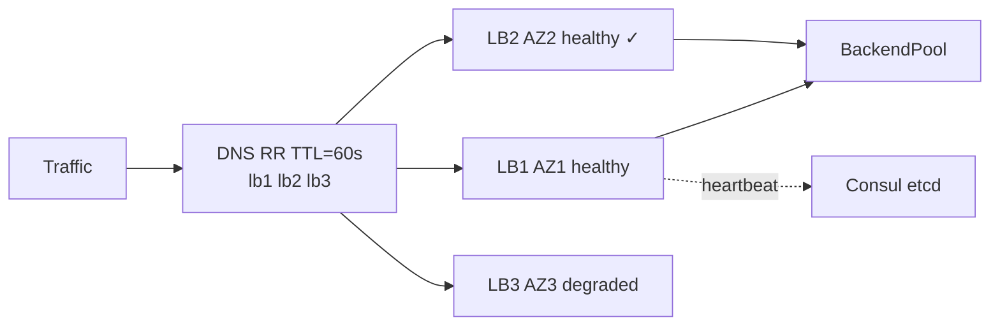

# load balancers

<div style="text-align: justify;">

## 0. intro

### 0.1. WTF is a load balancer

* arguably the most popular use case of proxy servers
- load balancing distributes incoming network traffic across multiple backend servers ensuring no single server overwhelmed
- load balancers are L4-L7 proxies implementing algorithms for even distribution health checks session persistence SSL termination WAF integration [stonefly][def]
- defining features active health checks failover session affinity content-based routing rate limiting observability metrics tracing

### 0.2. load balancers in the context of system design
- horizontal scaling stateless services: Kubernetes Ingress Controller, AWS ALB, NLB, GCP & HTTPS LB, Azure Load Balancer
- high availability 99.99%, uptime multi-AZ deployment, cross-region GSLB zero-downtime deploys blue-green canary traffic shifting
- microservices: east-west traffic service mesh, Istio, Linkerd, Consul Connect, Envoy sidecar, proxy pattern
- observability: OpenTelemetry traces, Prometheus metrics, Grafana dashboards, distributed tracing, request IDs

$$utilisation = \frac{traffic}{capacity} \ target\ 70-80\%$$

### 0.2. types of load balancers

- L4 TCP/UDP connection-level NGINX stream HAProxy TCP mode AWS NLB packet-level termination
- L7 HTTP/gRPC WebSocket application-aware path prefix host header regex URL rewriting header insertion Envoy NGINX Plus
- global server load balancing GSLB DNS anycast BGP cross-region latency-based routing F5 GTM AWS Route53
- internal service mesh Linkerd Istio internal discovery mTLS traffic policy Istio Gateway Ingress
- DNS load balancing simple round-robin TTL low fast global no health checks

#### 0.2.1. load balancer solutions

| category | examples | performance | cost | management |
|----------|----------|-------------|------|------------|
| hardware | F5 BIG-IP Citrix ADC A10 Thunder | 100Gbps ASIC 1M conn | $100k+ licencing | vendor support |
| software | NGINX HAProxy HAProxy Enterprise Envoy | 10-100Gbps CPU-bound | free/enterprise | self-manage |
| cloud | AWS ALB/NLB Azure LB GCP HTTPS LB Cloudflare LB | auto-scale infinite | $0.0225/hr + usage | fully managed |
| hybrid | Avi Networks Citrix ADC Cloud NGINX Plus AMI | multi-cloud portable | subscription | hybrid ops |



### 0.3. why TF are load balancers useful?

* common use cases
- web applications: stateless APIs, horizontal scale: PHP, Node.js, Go, Rust, Django Flask
- microservices service mesh east-west traffic Istio Envoy proxy injection traffic splitting
- databases read replicas PgBouncer ProxySQL MySQL Proxy Vitess sharding
- static content CDNs Cloudflare Akamai Fastly origin shield cache aggregation
- real-time WebSocket long-polling Server-Sent Events pub/sub Redis Streams Kafka
- high-throughput media streaming HLS DASH adaptive bitrate load by bandwidth

```mermaid
    graph LR
        User[Users] --> LB[Load Balancer<br/>Least Conn Algo]
        LB --> Server1[Server 1<br/>CPU 80% Conn 120]
        LB --> Server2[Server 2<br/>CPU 20% Conn 45 ✓]
        LB -.x-> Server3[Server 3<br/>HEALTH CHECK FAIL]
        Server2 --> Cache[Redis Cluster]
```

## 1. strategies and algos used in load balancing

### 1.1. round robin
#### 1.1.1. TF is round robin?
- static algorithm that cycles requests sequentially across healthy servers
- assumes uniform server capacity request sizes ignores current load state

#### 1.1.2. how TF  does it work?
- request counter % num_servers → server[index]
- server1 server2 server3 server1 server2 server3...
- handles server failure: skip unhealthy or rotate list

#### 1.1.3. pros and cons
**pros** 
- simple deterministic no state O(1) stateless horizontal scale
- predictable even distribution homogeneous uniform workloads
- memory efficient no tracking counters per server

**cons**
- uneven load heterogeneous hardware varying response times
- long-lived connections WebSocket TCP streams sticky issues
- slow startup servers or degraded nodes overload

$$server = request\_id \mod n$$



### 1.2. least connection

#### 1.2.1. TF is least connection?
- dynamic routes new connection to server with fewest active TCP connections
- adapts varying request durations long-polling WebSockets streaming

#### 1.2.2. how TF  does it work?
- track active_conns[server_id] select min(active_conns)
- weighted_conns[i] = active[i] / weight[i] capacity-aware
- sticky sessions update on SYN not FIN graceful drain

#### 1.2.3. pros and cons
**pros**
- handles heterogeneous loads real-time adaptation
- optimal for long-lived uneven duration requests
- self-balancing no manual tuning

**cons**
- state overhead connection tracking 1-10MB memory 10k servers
- race conditions conn++ / conn-- atomicity CPU cache line
- sudden spikes overload fastest server first

$$select = \arg\min_i \frac{conns_i}{weight_i}$$



### 1.3. least response time

#### 1.3.1. TF is least response time?
- dynamic selects server lowest average recent response time
- combines latency load comprehensive performance metric predictive

#### 1.3.2. how TF  does it work?
- rtt[server] = EWMA($\alpha \cdot rtt_{new} + (1-\alpha) \cdot rtt_{old}$)
- composite_score = rtt + $\beta \cdot \frac{conns}{weight}$
- measure connect queue service total end-to-end

#### 1.3.3. pros and cons
**pros**
- end-user performance optimised correlates user experience
- predictive slow servers avoided before failure
- adaptive varying workloads geo-distributed

**cons**
- measurement overhead timers histograms Prometheus
- network jitter noise smoothing $\alpha=0.1-0.3$
- proxy mode RTT includes upstream not pure server

$$\alpha = 0.125,\ EWMA_t = \alpha x_t + (1-\alpha) EWMA_{t-1}$$



### 1.4. IP hashing

#### 1.4.1. TF is hashing?
- static deterministic hash(client_ip % num_servers) session affinity
- sticky sessions stateful applications shopping carts login sessions

#### 1.4.2. how TF  does it work?
- hash = CRC32(sip,dip,port) or sip % 256 → server[hash]
- consistent hashing ring vnodes minimal remap add/remove
- IPv6 support sip_hash64 source IP preserve client identity

#### 1.4.3. pros and cons
**pros**
- session persistence no stateful tracking cookies
- cache locality CDN origin repeated requests same server
- DDoS mitigation ip reputation rate limits per hash

**cons**
- uneven distribution NAT many clients same IP
- DDoS single hash bucket overload
- server failure all sessions that bucket disrupted <br/><br/>

$hash(sip) = sip \mod n$

* [techtarget][def2]

```mermaid
    sequenceDiagram
        Client10[10.0.0.10<br/>hash=2] ->>+LB: req → S3
        Client10 ->>+LB: req → S3 sticky
        Client20[10.0.0.20<br/>hash=1] ->>+LB: req → S2
```

### 1.5. weighted algos

#### 1.5.1. TF is weighted algo?
- assigns capacity weights higher weight more traffic proportional
- heterogeneous servers powerful instances handle more load

#### 1.5.2. how TF  does it work?
- weight[server] static config CPU cores memory instance type
- traffic_share = weight_i / $\sum weights$ round-robin quanta
- dynamic weights Prometheus metrics CPU utilisation adjust

#### 1.5.3. pros and cons
**pros**
- optimal resource utilisation mixed fleets spot/reserved
- graceful degradation ramp down weak servers
- capacity planning SLO adherence

**cons**
- static drift manual tuning ops overhead
- weight misconfig cascade failures

#### 1.5.4. weighted round robin

- WRR cycles proportional weights (3:2:1 → s1×3 s2×2 s3×1)

* how it works

```plaintext
    weights [3,2,1] → s1 s1 s1 s2 s2 s3 repeat
    current_weight += weight max_weight = max(weights)
    select max(current_weight) reset
```

**pros** predictable proportional simple state
**cons** long connections uneven ignores runtime load



#### 1.5.5. weighted least connection

- least conn adjusted capacity conns[i]/w[i] minimal

* how it works
- score_i = active_conns_i / weight_i
- select argmin(score) tiebreak round-robin

**pros** dynamic capacity-aware heterogeneous optimal
**cons** stateful atomic increments CPU cache

#### 1.5.6. weighted least response time

- rtt[i]/w[i] minimal composite metric

* how it works <br/><br/>

$score = rtt_i + \gamma \cdot \frac{conns_i}{w_i}$

**pros** performance capacity optimal predictive
**cons** measurement noise smoothing parameters

#### 1.5.7. weighted IP hashing

- hash(sip) → weighted ring replicas proportional vnodes

* how it works
- S1:3 vnodes S2:2 vnodes → 60%/40% traffic
- ketama consistent hash minimal remap

**pros** sticky capacity-aware no runtime state
**cons** hash skew hotspots collisions

### 1.6. geographic

#### 1.6.1. TF is geographic strategy?
- routes client geoip closest datacentre latency compliance

#### 1.6.2. how TF  does it work?
- MaxMind GeoIP2 db → ASN country city → DC mapping
- latency tables ping probes active RTT anycast BGP
- edge locations Cloudflare 300+ cities AWS Global Accelerator

#### 1.6.3. pros and cons
**pros**
- low latency user experience continental compliance GDPR
- content localisation language currency stock

**cons**
- GeoIP inaccuracy 95% country VPN Tor circumvention
- cold regions traffic to distant DCs



### 1.7. consistent hashing

#### 1.7.1. TF is consistent hashing?
- hash ring virtual nodes minimal remapping scale-in/out
- session affinity cache locality stateful horizontal scaling

#### 1.7.2. how TF  does it work?

```plaintext
    MD5(key) → ring position clockwise next vnode owner
    S1: 3 vnodes S2: 2 vnodes K=160bit ring
    add S4 → ~1/(n+1) traffic shift max per key
```

$$\text{remap fraction} = \frac{1}{n+1} \ll 50\%$$

#### 1.7.3. pros and cons
**pros**
- scale-in/out minimal disruption 1/n traffic moves
- sticky sessions cache hit rates high
- predictable mathematical guarantees

**cons**
- ring hotspots hot partitions skew variance
- vnodes tuning 100-1000/node balance load variance
- stateful ring maintenance leader election

```mermaid
    graph TD
        subgraph ring["160-bit Hash Ring"]
            S1v1((S1 v1))
            S1v2((S1 v2))
            S1v3((S1 v3))
            S2v1((S2 v1))
            S2v2((S2 v2))
            S3v1((S3 v1))
        end
        KeyA[hash(A)] -.->|owner| S1v2
        KeyB[hash(B)] -.->|owner| S2v2
```

## 2. features of load balancers

### 2.1. continuous health checks

#### 2.1.1 TF is a health check?
- active probes TCP connect HTTP status gRPC unary RPC status
- passive metrics connection success error rates response times

#### 2.1.1. how TF do load balancers achieve this?
- intervals 2s-30s timeouts 1s-5s consecutive fails 2-3
- endpoints /healthz /ready /live Kubernetes liveness/readiness/startup
- jitter randomise prevent thundering herd sync failure



### 2.2. SSL/TLS termination

#### 2.2.1 TF is SSL/TLS termination?
- decrypts TLS 1.3 offloads asymmetric crypto AES-GCM from backends
- re-encrypt origin mTLS optional HTTP/2 ALPN h2 h3
- session resumption tickets 0-RTT anti-replay protected
#### 2.2.2. pros and cons
**pros** CPU savings 5-10x backends stateless TLS memory
**cons** proxy trust TLS fingerprint single decrypt attack surface

### 2.3. session persistence (sticky sessions)
#### 2.3.1 TF is session persistence?
- cookie insertion serverid=1 signed hmac IP hash app cookie affinity
- duration session permanent timeout graceful drain sticky
- WebSocket upgrade consistent routing long-lived
#### 2.3.2. pros and cons
**pros** stateful apps shopping carts user sessions WebSocket
**cons** uneven load unhealthy sticky overload cache invalidation

### 2.4. rate limiting throttling
#### 2.4.1 TF is rate limiting throttling?
- token bucket $tokens = \min(tokens + \lambda \Delta t, burst)$ refill rate
- leaky bucket constant drain fixed window sliding window
- distributed Redis Lua atomic counters tenant quotas API keys
#### 2.4.2. pros and cons
**pros** DDoS protection fair usage SLA enforcement abuse prevention
**cons** state coordination false positives bursty traffic

### 2.5. WAF web application firewall
#### 2.5.1 TF is WAF?
- OWASP CRS ModSecurity Coraza Rust signatures SQLi XSS CSRF XXE
- anomaly scoring regex Lua WAF eval ML behavioural
- managed Cloudflare AWS WAF F5 ASM ruleset updates
#### 2.5.2. pros and cons
**pros** zero-trust L7 protection compliance PCI GDPR audit logs
**cons** false positives tuning latency 1-5ms overhead

### 2.6. content routing caching
#### 2.6.1 TF is client routing caching?
- VCL Varnish Configuration Language edge side includes ESI fragments
- Cache-Control ETag stale-while-revalidate stale-if-error
- proxy-cache nginx memcached Redis dynamic content
#### 2.6.2. pros and cons
**pros** 90% cache hit origin offload bandwidth savings
**cons** invalidation complexity cache stampede TTL tuning

### 2.7. observability logging metrics tracing

- access logs JSON structured request_id traceparent
- Prometheus metrics conn/sec latency P99 errors 5xx
- OpenTelemetry spans service mesh distributed tracing Jaeger Tempo

## 3. WTF happens when a load balancer goes down?

* load balancer failure is considered a single-point-of-failure type of failure
- single-point-of-failure (SPOF) component whose failure causes entire system outage
- LB down → SYN flood drop 100% traffic backends healthy unused
- cascading effects client timeouts retries amplified load upstream DNS queues

### 3.1. minimisation mitigation and alleviation strategies/algos

#### 3.1.1. redundancy

* TF is redundancy?
- N+1 multiple LB instances active/passive active/active multi-AZ

* how it works
- VRRP Keepalived floating VIP anycast ECMP DNS round-robin
- leader election etcd Consul ZooKeeper Raft consensus
- state sync connection drain ARPs gratuitous

* how TF does it fit in sys design?
- Kubernetes external LoadBalancer internal controller-manager
- AWS ALB multi-AZ auto-failover Route53 health checks

**use cases**
- global web tier: NGINX, ASG, Cloudflare, anycast
- internal: k8s, Istio Gateway, multi-replica

**pros** zero-downtime, automatic failover, 99.999% uptime
**cons** split-brain, fencing, sync lag, state complexity, cost 2x



#### 3.1.2. health checks and monitoring

* TF is health checks and monitoring?
- continuous active/passive probes remove unhealthy promote healthy

* how it works
- Prometheus Blackbox Exporter HTTP TCP DNS ICMP gRPC
- alerting PagerDuty Slack Opsgenie runbooks Terraform drift
- anomaly detection ML latency spikes error rates

* how TF does it fit in sys design?
- service level objectives SLO 99.9% error budget alerting
- chaos engineering Netflix Chaos Monkey kill LBs validate

**pros** proactive, fast recovery, self-healing, capacity planning
**cons** false positives, flap damping, tuning intervals, CPU probes

#### 3.1.3. auto-scaling and self-healing

* TF is auto-scaling and self-healing?
- dynamic scale LB nodes based metrics autoscaler KEDA event-driven

* how it works

```plaintext
    if avg_cpu > 70% ∧ pending_conns > threshold:
        scale_up(max_replicas=20)
    if avg_cpu < 30% ∧ idle > 10min:
        scale_down(min_replicas=2)
```

* how TF does it fit in sys design?
- Kubernetes Cluster Autoscaler, HPA, VPA, Karpenter, spot instances
- serverless AWS Lambda, provisioned concurrency, API Gateway throttling

**pros** elastic, cost-efficient, handles diurnal spikes, auto-healing
**cons** cold starts, 10-60s provision lag, state sync, sync lag

#### 3.1.4. DNS failover

* TF is DNS fail-over?
- multiple A/CNAME records health checks dynamic DNS updates

* how it works
- Route53 health checks latency-based failover GSLB
- TTL 60s propagation client DNS cache resolver cache
- active-active weighted records failover weights 100% healthy

* how TF does it fit in sys design?
- global applications: multi-region, active-active read replicas
- CDN: origin failover, Cloudflare, traffic steering

**pros** simple, no app changes, global scale, cost-effective
**cons** propagation lag, 30s-5min stale, DNS clients, TCP retries

| strategy | RTO recovery time | RPO data loss | complexity | cost |
|----------|-------------------|---------------|------------|------|
| redundancy | 2-10s | none | high | 2-3x |
| health checks | 10-60s | none | medium | low |
| auto-scaling | 1-5min | minor | high | variable |
| DNS failover | 1-5min | none | low | low |

</div>


[def]: https://stonefly.com/resources/load-balancing-algorithms-types-use-cases/
[def2]: https://www.techtarget.com/searchnetworking/definition/TCP